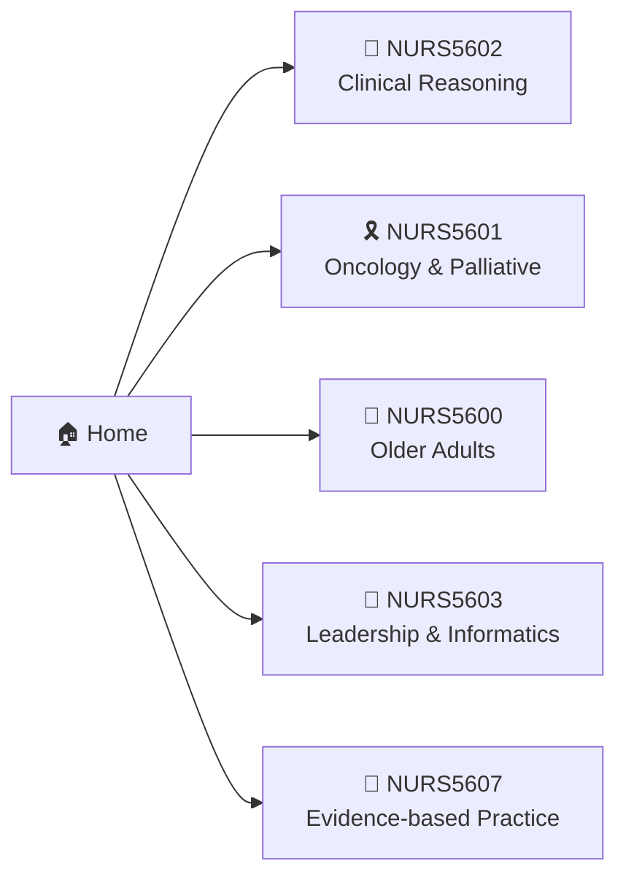

# 🏠 Welcome to the Year 5 Study Guide! 🎓

👋 Hey there, fellow night-shift scholar! This is my personal study hub for **HKUMed Bachelor of Nursing — Year 5** 🏥. Everything I learn, cram, and occasionally panic about lives here — wrapped in a **clean Windows 11 look** 🪟, because studying is more fun when your notes feel like a fresh desktop on a Monday morning. ✨

!!! tip "💡 How to use this site"
    Pick a course from the tabs above ☝️ or the table below 👇. Each course folder has its own landing page with roadmaps, topic lists, and diagrams. More notes drop in as the semester rolls on! 📅

!!! warning "⚠️ Study disclaimer"
    These are **personal study notes**, not official course materials. Always double-check against lecture slides and your lecturers' guidance! 🧑‍🏫

## 📚 The Year 5 Line-up

| Emoji | Code | Course Title | Jump In |
|:-----:|:-----|:-------------|:-------:|
| 🧠 | **NURS5602** | Clinical Reasoning in Practice | [Open ➡️](nurs5602-clinical-reasoning/index.md) |
| 🎗️ | **NURS5601** | Oncology Nursing and Palliative Care | [Open ➡️](nurs5601-oncology-palliative/index.md) |
| 👵 | **NURS5600** | Nursing of Older Adults | [Open ➡️](nurs5600-older-adults/index.md) |
| 👑 | **NURS5603** | Leadership, Management and Informatics | [Open ➡️](nurs5603-leadership-informatics/index.md) |
| 🔬 | **NURS5607** | Evidence-based Practice | [Open ➡️](nurs5607-evidence-based-practice/index.md) |

## 🗺️ Site Map (Mermaid test drive 🚗)

## ⚡ Quick Links

- 🐙 [GitHub Repository](https://github.com/PureCo2Fe/BNurs-Y5) — source of truth
- 🏫 [HKUMed](https://www.med.hku.hk/) — the mothership
- 📝 This page in the repo: `docs/index.md`

## ✅ Semester Checklist

- [x] 🪟 Set up a fresh Windows 11 study site
- [x] 📂 Create one folder per course
- [ ] 🧠 Survive clinical reasoning
- [ ] 🔬 Finish the EBP assignment
- [ ] 🎉 Graduate!!!

!!! note "🪟 Fun fact"
    Windows 11's accent blue is officially called **"Fluent"** — and this site wears it proudly. This entire website is still smaller than one modern cat photo. 🐈📷
