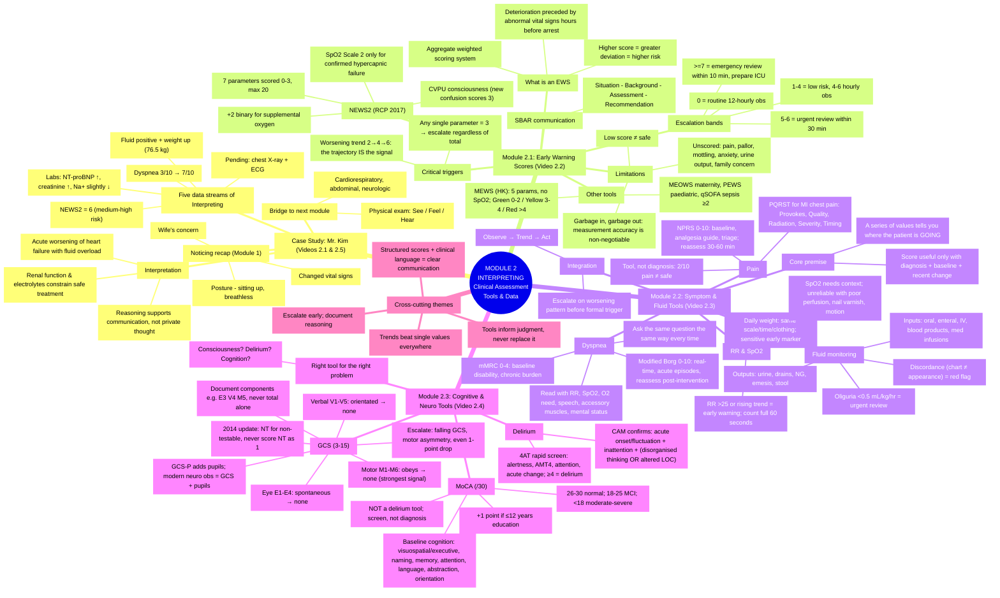

# Comprehensive Study Guide
## Clinical Reasoning Using Tanner's Clinical Judgement Model — Module 2: Interpreting – Clinical Assessment Tools and Data

> **Source:** HKU LKS Faculty of Medicine, School of Nursing — NURS5602 *Clinical Reasoning in Practice* (Presenter: Polly Li, Associate Professor, School of Nursing, HKU)
> **Compiled from:** five video segments (2.1–2.5), integrating the full English narration with all on-screen slides, charts, tables, and clinical scenes.

---

## 1. Overview: How the Five Videos Fit Together

Module 2 covers the **Interpreting** phase of Tanner's Clinical Judgement Model — making sense of the cues gathered during Noticing (Module 1). The case patient, **Mr. Kim Wai-Man**, threads through the module: his deteriorating vital signs, scores, fluid status, and lab results are used to demonstrate each assessment tool in action.

| File | On-screen module label | Title | Duration | Role in the module |
|---|---|---|---|---|
| 2.1 | — (module title card) | Module 2: Interpreting – Clinical Assessment Tools and Data | ~2 min 48 s | **Case study opener** — Mr. Kim's data organized into five streams (NEWS2, dyspnea, fluid/weight, labs, pending investigations) |
| 2.2 | MODULE 2.1 | Interpreting Early Warning Scores in Context | ~9 min 7 s | **Theory: EWS tools** — NEWS2, MEWS, MEOWS, PEWS, qSOFA; thresholds, trends, SBAR, limitations |
| 2.3 | MODULE 2.2 | Symptom and Fluid Assessment Tools in Acute Care | ~11 min 38 s | **Theory: symptom/fluid tools** — Borg, mMRC, NPRS, PQRST, fluid balance, daily weight, RR/SpO₂ trending |
| 2.4 | MODULE 2.3 | Cognitive and Neurological Tools in Acute Care | ~9 min 20 s | **Theory: cognitive/neuro tools** — GCS, 4AT, CAM, MoCA |
| 2.5 | — (module title card) | Module 2 conclusion | ~1 min 27 s | **Case study close** — converging data → "acute worsening of heart failure with fluid overload"; bridge to physical examination |

> ⚠️ **File-name vs. module-number mismatch:** the file *2.2* is labelled "MODULE 2.1" on screen, *2.3* is "MODULE 2.2", and *2.4* is "MODULE 2.3". This guide follows the **on-screen module numbering** for the theory sections.

---

## 2. Overall Mindmap

### 2.1 Visual mindmap (Mermaid)



### 2.2 Text-outline mindmap (fallback for viewers without Mermaid)

```
MODULE 2 — INTERPRETING: CLINICAL ASSESSMENT TOOLS & DATA
│
├── CASE STUDY: MR. KIM (videos 2.1 & 2.5)
│   ├── Noticing recap (Module 1): changed vital signs · posture · wife's concern
│   ├── Five data streams of Interpreting
│   │   ├── NEWS2 = 6 (medium–high risk, above morning baseline)
│   │   ├── Dyspnea rating 3/10 → 7/10
│   │   ├── Fluid balance positive (in 750 mL vs out 100 mL) + weight up (76.5 kg)
│   │   ├── Labs: NT-proBNP markedly elevated · creatinine rising · sodium slightly low
│   │   └── Pending investigations: chest X-ray + ECG
│   ├── Interpretation: acute worsening of HEART FAILURE with FLUID OVERLOAD
│   │   └── Renal function + electrolytes → treatment-safety questions
│   └── Bridge: physical examination — See / Feel / Hear (cardiorespiratory, abdominal, neurologic)
│
├── MODULE 2.1 — EARLY WARNING SCORES (video 2.2)
│   ├── EWS = aggregate weighted scoring system; read in context (baseline, changes, condition)
│   ├── NEWS2 (RCP 2017): 7 parameters × 0–3 + O₂ (+2); max 20
│   │   ├── Parameters: RR · SpO₂ (Scale 1/2) · SBP · HR · Temp · CVPU · supplemental O₂
│   │   ├── Bands: 0 routine · 1–4 low · 5–6 medium (30-min review) · ≥7 high (10-min, ICU prep)
│   │   └── Red flags: single parameter = 3 · worsening trend ("trajectory IS the signal")
│   ├── Other tools: MEWS (HK, 5 params, colour zones G/Y/R) · MEOWS · PEWS · qSOFA (≥2 = sepsis?)
│   ├── SBAR: Situation · Background · Assessment · Recommendation
│   └── Limitations: low score ≠ safe · unscored features · measurement accuracy (GIGO)
│
├── MODULE 2.2 — SYMPTOM & FLUID TOOLS (video 2.3)
│   ├── Premise: structured data → communicate, trend, escalate; context is mandatory
│   ├── Dyspnea: modified Borg 0–10 (real-time) vs mMRC 0–4 (baseline disability)
│   ├── Pain: NPRS 0–10 + reassess 30–60 min post-analgesia; PQRST for MI chest pain
│   ├── Fluids: I&O chart (all inputs/outputs) · daily weight (standardized) ·
│   │   oliguria <0.5 mL/kg/hr · post-op third spacing (first 48 h) · discordance alert
│   ├── RR & SpO₂: RR >25 or rising = early warning (count 60 s); SpO₂ always in context
│   └── Integration: Observe → Trend → Act; escalate on pattern before formal trigger
│
├── MODULE 2.3 — COGNITIVE & NEUROLOGICAL TOOLS (video 2.4)
│   ├── Bedside question: "consciousness, delirium, or cognition?"
│   ├── GCS 3–15 (E1–4 / V1–5 / M1–6; components separately; NT for non-testable;
│   │   GCS + pupils; trend over snapshot; 1-point drop = escalate)
│   ├── Delirium: 4AT screens (≥4) → CAM confirms (features 1+2 + 3 or 4)
│   └── MoCA /30: baseline cognition (26–30 normal · 18–25 MCI · <18 moderate–severe;
│       +1 education adjustment; NOT a delirium tool; screen, not diagnosis)
│
└── CROSS-CUTTING THEMES
    ├── Trends beat single values (in every domain)
    ├── Tools inform judgment — never replace it
    ├── Escalate early, document reasoning, use SBAR
    └── Scores + clinical language = clear, concise communication
```

---

## 3. Case Study Opener — Mr. Kim Enters the Interpreting Phase (Video 2.1, ~2 min 48 s)

### 3.1 From Noticing to Interpreting

- In Module 1, Nurse Lee recognized that Mr. Kim was deteriorating (the **Noticing** phase). The cues she noticed — shown as a labelled photo collage — were: **"Change of vital signs"**, **"Patient's posture"** (sitting up, leaning forward, breathless), and **"Wife's concerns"**.
- Module 2 moves to the **Interpreting** phase: understanding what those findings mean. Nurse Lee starts to **organize the data she has collected**, confirms the changes, and calls for a review while continuing to observe him closely.

### 3.2 Vital-sign deterioration vs. the patient's own baseline

Split-screen comparison (on room air, "RA"):

| Parameter | Morning baseline | Now |
|---|---|---|
| Respiratory rate (RR) | 22 | **30** |
| SpO₂ | 93% | **88%** |
| Heart rate (HR) | 98 | **110** |
| Blood pressure (BP) | 158/88 | 159/90 |

Deterioration is always judged **against the patient's own baseline**, not against generic normals.

### 3.3 NEWS2 — expressing risk clearly

Nurse Lee records the vital signs and calculates a **National Early Warning Score (NEWS2)**. The video displays the full official chart:

**Chart 1: The NEWS scoring system** (score columns 3 · 2 · 1 · 0 · 1 · 2 · 3)

| Parameter | 3 | 2 | 1 | 0 | 1 | 2 | 3 |
|---|---|---|---|---|---|---|---|
| Respiration rate (/min) | ≤8 | | 9–11 | 12–20 | | 21–24 | ≥25 |
| SpO₂ Scale 1 (%) | ≤91 | 92–93 | 94–95 | ≥96 | | | |
| SpO₂ Scale 2 (%) | ≤83 | 84–85 | 86–87 | 88–92 / ≥93 on air | 93–94 on O₂ | 95–96 on O₂ | ≥97 on O₂ |
| Air or oxygen? | | O₂ | | Air | | | |
| Systolic BP (mmHg) | ≤90 | 91–100 | 101–110 | 111–219 | | | ≥220 |
| Pulse (/min) | ≤40 | | 41–50 | 51–90 | 91–110 | 111–130 | ≥131 |
| Consciousness | | | | Alert | | | CVPU |
| Temperature (°C) | ≤35.0 | | 35.1–36.0 | 36.1–38.0 | 38.1–39.0 | ≥39.1 | |

- **Mr. Kim's NEWS2 = 6** — "medium to high risk range, well above his morning baseline."
- Teaching point: the structured tool helps the nurse **express the level of risk clearly** to the team.

### 3.4 Dyspnea rating — subjective and objective data align

- Nurse Lee asks Mr. Kim to rate his breathlessness: **3/10 this morning → 7/10 now**.
- Key point: **his subjective experience aligns with the objective deterioration** — patient-reported and measured data corroborate each other.

### 3.5 Fluid balance and weight — the overload pattern

On-screen **Fluid Intake and Output chart** (verbatim details): Name **Kim Wai-Man**; Birth Date **04/09/1958**; Date **01-06-2026**; Weight **76.5 kg**.

| Time | Intake | Output |
|---|---|---|
| 10 am | drinking water 200 mL | — |
| 12 pm | soup 150 mL | urine 50 mL |
| 2 pm | drinking water 200 mL | 0 |
| 4 pm | drinking water 200 mL | urine 50 mL |
| **Recorded totals** | **750 mL** | **100 mL** |

- Intake exceeds output → **positive fluid balance**; weight is **up from admission**.
- Interpretation: these data points support a pattern of **fluid overload rather than anxiety or isolated shortness of breath**.

### 3.6 Laboratory results — hypothesis support, not standalone diagnosis

| Test | Result | Interpretation given |
|---|---|---|
| **NT-proBNP** | Markedly elevated | Supports **heart failure** as a major contributor to his dyspnea |
| **Creatinine** | Rising | Suggests the **kidneys are affected** |
| **Sodium** | Slightly low | Part of the treatment-safety picture |

Explicit caution from the narration: *"These tests do not diagnose by themselves, but they strengthen the heart failure hypothesis and raise questions about how safely he can be treated."*

### 3.7 Pending investigations

- Based on the bedside picture + labs + scoring, the team orders a **chest X-ray** and an **ECG**; Nurse Lee ensures Mr. Kim is prepared and the tests are completed without delay.
- These investigations **add detail** to the picture she has already begun to interpret.

### 3.8 Synthesis — the five data streams of Interpreting

The closing mind-map (orange "Interpreting" arrow branching to five boxes):

**NEWS2 score · Dyspnea rating · Fluid balance/weight · Lab results · Pending investigations**

> "At this point, she has moved beyond noticing isolated cues. She is interpreting **patterns across tools, tests, and the patient's story**."

---

## 4. Module 2.1 — Interpreting Early Warning Scores in Context (Video 2.2, ~9 min 7 s)

### 4.1 What is an Early Warning Score? (Foundation concept)

- **Definition (verbatim):** "An EWS is an **aggregate weighted scoring system** that assigns numeric scores to routinely collected physiological parameters. Higher scores signal greater deviation from normal and a higher risk of clinical deterioration."
- **Why it matters:** research from the 1990s showed that **deterioration is preceded by abnormal vital signs hours before cardiac arrest**. EWS tools standardise recognition, trigger escalation, and give nurses a **common language** with the medical team.
- **Different tools, same principle:** **NEWS2** (UK/NHS standard), **MEWS** (widely used internationally), **MEOWS** (maternity), **PEWS** (paediatric) — each tailored to its population; **your institution determines which tool to use**.
- **The nurse's central role:** nurses are the primary recorders and interpreters of vital signs. **Accurate measurement, correct scoring, and timely escalation are professional accountabilities** — whether delegated or performed directly.
- Framing: an EWS is **never just a number** — it is a clinical signal that must be read alongside the patient's **baseline, recent changes, and overall condition**. The goal: move **from score to action**.

### 4.2 NEWS2 in detail (Royal College of Physicians, 2017)

Seven parameters, each scored 0–3; supplemental oxygen adds a binary +2. **Maximum aggregate score = 20.**

| Parameter | Key facts from the slides |
|---|---|
| **Respiratory rate** | Breaths/min, scored 0–3; **RR ≥25 scores 3 — an immediate red flag** |
| **SpO₂ (Scale 1 or 2)** | Peripheral oxygen saturation; **Scale 2 applies only in confirmed hypercapnic respiratory failure** |
| **Systolic BP** | Low or very high systolic pressure scored; **hypotension ≤90 mmHg scores 3** |
| **Heart rate** | Both bradycardia and tachycardia scored; **HR ≥131 bpm scores 3** |
| **Temperature** | Both hypothermia and hyperthermia penalised; **≤35.0 °C scores 3** |
| **Consciousness (CVPU)** | New **C**onfusion, responds to **V**oice, responds to **P**ain, **U**nresponsive; **any deviation from Alert scores 3** |
| **Supplemental oxygen** | Binary **+2** if receiving any supplemental oxygen; not scored 0–3 |

> New confusion (via the CVPU scale) was **introduced in NEWS2** and scores 3 — a significant upgrade from the original NEWS tool.

### 4.3 NEWS2 escalation thresholds (NICE / RCP framework)

| Score | Risk band | Required response (verbatim from slides) |
|---|---|---|
| **0** | Stable | Routine monitoring, minimum 12-hourly observations. No immediate escalation; continue to observe for any change. |
| **1–4** | Low risk | Minimum 4–6 hourly observations. Ward nurse assesses; escalate if score increases or any clinical concern — do not wait for the next scheduled obs round. |
| **5–6** | Medium risk | **Urgent review by a doctor or acute care nurse within 30 minutes.** Consider HDU or critical care escalation. Increase monitoring to hourly or continuous. |
| **≥7** | High risk | **Emergency assessment by critical care or Rapid Response Team within 10 minutes.** Continuous monitoring. Prepare for potential ICU transfer and activate major deterioration protocols. |

> ⚠️ **Red flag:** a **single parameter scoring 3** triggers an urgent review **regardless of the aggregate total** — do not wait for a higher overall number before escalating.

### 4.4 Trend matters as much as score

Worked trend example from the slide ("Concern Despite Low Score"):

- **06:00 — NEWS2 = 2** (green)
- **10:00 — NEWS2 = 4** (yellow) → continue regular observations, document baseline, note any parameter close to a threshold
- **14:00 — NEWS2 = 6 ⚠** (orange/red) → *"Rising 2 → 4 → 6 warrants **strong concern** even before reaching ≥7. **The trajectory IS the signal.**"*

**Clinical action by trigger:**

1. **NEWS2 ≥ 5** — prompt urgent clinical review by a clinician with acute-care competency; use **SBAR** to communicate clearly.
2. **Any single parameter = 3** (e.g., RR ≥25, SpO₂ ≤91%, new confusion) — **escalate immediately** regardless of total.
3. **Worsening trend** — a consistent upward trend across observations is itself a trigger; act early, document reasoning, do not wait for a threshold to be crossed.

### 4.5 Other early warning tools (institutional variation)

| Tool | Parameters | Threshold | Context / population |
|---|---|---|---|
| **NEWS2** (RCP, 2017) | RR, SpO₂ (2 scales), BP, HR, Temp, LOC + O₂ supplement (7 total) | ≥5 medium; ≥7 high | UK NHS standard; endorsed for sepsis & COVID-19 detection; max score 20 |
| **MEWS** (international) | Systolic BP, HR, RR, Temp, AVPU (5 parameters) | ≥5 or any = 3 → higher level care | Used across many institutions globally; does **not** include SpO₂ or O₂ supplement scoring |
| **MEOWS** (maternity) | NEWS-based + urine output, general status; colour-coded Yellow/Red | ≥1 Red or ≥3 Yellow triggers alert | Perinatal: antepartum, labour, delivery, up to 6 weeks postpartum |
| **PEWS** (paediatric, NHS England) | Age-adjusted physiological norms; includes behavioural parameters | Age-specific thresholds | Children <16 yrs; paediatric normal ranges differ significantly from adults |
| **qSOFA** (sepsis screening) | Altered LOC + RR ≥22 + SBP ≤100 (3 binary items) | ≥2 = suspected sepsis | Rapid bedside sepsis screen; less sensitive than NEWS2 but very quick |

> **Know your institution's tool.** Parameters and thresholds vary between organisations — always follow local policy. The transferable skill is **interpreting the score and knowing when to escalate**, not memorizing every chart.

### 4.6 MEWS in Hong Kong practice

- **Definition (verbatim):** "The Modified Early Warning Score (MEWS) is a bedside physiological **track-and-trigger tool** used to identify adult patients at risk of clinical deterioration – simple, rapid, and validated in Hong Kong settings."
- **The 5 core parameters:** Systolic BP · Heart Rate · Respiratory Rate · Temperature · Consciousness (**AVPU**).
- ⚠️ Unlike NEWS2, classic MEWS does **not** include SpO₂ or supplemental oxygen in the core score.
- **Why MEWS in Hong Kong?**
  - **Validated locally** — studied in HK ED observation wards; **MEWS >4 linked to higher risk of ICU admission and death**.
  - **Colour-alert charts** — many HK hospitals use colour-zone observation charts to simplify interpretation and improve escalation compliance.
  - **Simpler than NEWS2** — easier in busy wards, though it captures fewer physiological domains.
- **MEWS colour zones (staircase diagram):**
  - 🟩 **GREEN (0–2):** routine monitoring
  - 🟨 **YELLOW (3–4):** nurse review & doctor notification
  - 🟥 **RED (>4):** urgent medical attention & intensified care

**Structuring your response to a raised MEWS (01–04):**

1. **Repeat observations** — confirm the score and document the trend.
2. **Inform senior nurse/doctor** — use **SBAR** to communicate clearly and concisely.
3. **Increase monitoring frequency** — adjust observation intervals per local protocol.
4. **Follow institutional protocol** — MEWS thresholds and escalation responses vary across hospitals and specialties.

> ⚠️ MEWS does **not** replace clinical judgement. New confusion, respiratory distress, pallor, reduced urine output, or a strong "looks wrong" impression should always prompt concern — regardless of score. Trend matters as much as the single number.

### 4.7 SBAR — turning the score into an actionable message

Worked example (verbatim from the slide):

- **S — Situation:** "I am calling about Mr Chan in Bed 5. My NEWS2 is 6 – up from 3 two hours ago. He is more breathless and looks unwell."
- **B — Background:** "Admitted 2 days ago with CAP. Known COPD – baseline SpO₂ 90%. Current: SpO₂ 88%, RR 26, HR 108, Temp 38.9 °C, BP 102/64. On 2 L nasal cannulae."
- **A — Assessment:** "I think he may be deteriorating – possibly sepsis. He looks pale and anxious. This is worse than his baseline."
- **R — Recommendation:** "I need you to come and review him urgently within the next 30 minutes. Is there anything I should do in the meantime?"

**Contextual interpretation rules:**

- **Know the baseline** — SpO₂ 92% may be normal for one patient but alarming for another; compare to admission values and comorbidities.
- **Consider recent changes** — new medications (opioids, antihypertensives), post-procedure status, recent blood transfusion all affect physiology and score interpretation.
- **Use SpO₂ Scale 2** only when confirmed hypercapnic respiratory failure is documented by a senior clinician; **default is always Scale 1**.
- **NEWS2 ≥5 → think sepsis** — any suspected infection plus a score ≥5 should trigger the question: *"Is this sepsis?"*

### 4.8 Limitations — support, not substitute, for judgement

1. **A low score does not mean "safe."** A patient can look clinically wrong with a NEWS2 of 2–3; a single abnormal parameter may not yet push the total high. **Your clinical gut feeling is valid evidence — trust it and document it.**
2. **NEWS2 does not capture everything.** Pain, pallor, mottling, patient anxiety, urine output, and family concern are **not scored**; clinical assessment integrates all of these alongside the number.
3. **Score quality depends on measurement accuracy.** Measured (not estimated) RR over 60 seconds, correctly sized BP cuff, confirmed temperature method — **"garbage in, garbage out."** Accurate technique is the non-negotiable foundation.

### 4.9 Key principles and takeaways (from score to action)

**Five key principles to carry forward:**

1. EWS **aggregates physiology** into a risk score — use it as a framework, not a final answer.
2. **Trends matter more than single values** — a rising score is an alarm even if the current number seems low.
3. **You can always escalate without a threshold** — if you are worried, call. Document your reasoning.
4. **Context is everything** — baseline values, comorbidities, and recent events all shape interpretation.
5. **SBAR structures your voice** — know the score, tell the story, make the recommendation.

**Four closing imperatives (summary cards):**

- **Measure Accurately** — every parameter counts; technique errors corrupt the score and can delay or misdirect escalation.
- **Score Correctly** — apply the right SpO₂ scale (1 vs 2), include supplemental oxygen, and use **CVPU — not AVPU — for NEWS2**.
- **Watch the Trend** — a rising score over time is as important as the number itself; document each set of observations and compare.
- **Escalate Early** — use SBAR, act on single-parameter red flags, never wait for a higher score if you are clinically concerned.

> **Remember:** "Early Warning Scores are tools to support your clinical judgement – not to replace it. The score gives you a shared language; your assessment gives it meaning. **Speak up early, escalate clearly, and document everything.**"

---

## 5. Module 2.2 — Symptom and Fluid Assessment Tools in Acute Care (Video 2.3, ~11 min 38 s)

### 5.1 Numbers that support clinical reasoning

- Symptom scores and monitoring tools **convert subjective findings into structured clinical data** that can be **communicated, trended, and escalated**.
- In acute illness, **repeat measurements are often more informative than a single observation**, because deterioration and treatment response evolve over time.
- Three pillars from the slide:
  - **Trend over time** — *"A single value tells you where a patient is. A series of values tells you where they are **going**."*
  - **Clinical context** — tools are most useful in **heart failure, COPD, pneumonia, renal failure, and post-operative care**.
  - **Structured communication** — scored data enables precise handover, giving nurses a story to tell senior staff.
- Bottom line: **a score is useful only when linked to the patient's diagnosis, baseline, and recent change.**

### 5.2 Quantifying breathlessness — two dyspnea scales

| Tool | Scale | Best used for |
|---|---|---|
| **Modified Borg Scale** | 0–10, real-time breathlessness intensity | **Acute episodes** and **immediate reassessment** — e.g., before and after a bronchodilator or repositioning |
| **mMRC Dyspnea Scale** | 5 levels (0–4), grades functional limitation | **Baseline disability** and chronic symptom burden — less applicable to moment-to-moment change |

> **Consistency habit:** ask the **same dyspnea question the same way** each time — serial comparison is only meaningful if the question and method stay consistent.

### 5.3 When dyspnea scoring is especially helpful

- **Acute heart failure** — dyspnea measurement tracks symptom burden and response to **diuresis or oxygen therapy** (local protocol guides scale choice).
- **COPD and pneumonia** — worsening breathlessness may signal **increased work of breathing, treatment failure, or progression toward respiratory compromise** → warrants urgent escalation.
- **The full respiratory picture** — interpret dyspnea scores **with**: RR, SpO₂, oxygen requirement, speaking ability, accessory muscle use, and mental status.
- ⚠️ *"Less breathless"* after an intervention is clinically meaningful **only if supported by improved respiratory observations and overall appearance.**

### 5.4 Pain score 0–10 (NPRS) — what it adds

- The **Numeric Pain Rating Scale** gives a fast, reproducible measure of pain intensity for **initial assessment** and **reassessment after analgesia**.
- Three uses: **initial assessment** (baseline for urgency, guides analgesia choice in surgical/emergency settings); **post-intervention review** (**reassess 30–60 minutes after analgesia** to confirm effectiveness); **prioritization tool** (triage urgency in emergency settings).
- ⚠️ Pain scores should **not stand alone** — location, quality, onset, associated symptoms, and functional impact still matter.

### 5.5 Interpreting pain within the clinical picture

- **When pain scoring is central:** post-operative care and acute abdominal conditions — worsening or poorly controlled pain may indicate **surgical complications, inadequate analgesia, or evolving pathology** requiring urgent review.
- **When other indicators take priority:** in **heart failure**, absence of chest pain does **not** indicate safety; **dyspnea, orthopnea, fluid retention, oxygen requirement, and fatigue** are often more informative than the pain score.
- **The key question:** *"Is pain the main problem in this condition, or is another symptom more important for immediate interpretation?"*
- ⚠️ Avoid **false reassurance** from a low pain score — **a patient can score 2/10 in pain and still be in danger.**

### 5.6 PQRST — characterizing chest pain in myocardial infarction

| Letter | Focus | MI-typical findings (verbatim from slides) |
|---|---|---|
| **P** | Provokes / Palliates | What brings it on, worsens, or relieves it? MI pain is often **provoked by exertion or stress** and **not relieved by rest or antacids**; nitroglycerin may partially/briefly alleviate it, but pain often recurs. |
| **Q** | Quality | **Crushing, squeezing, pressure, tightness, or a heavy sensation** in the chest. Sharp, stabbing, or pleuritic descriptions are less typical for MI. |
| **R** | Radiation | Commonly radiates to the **left arm, jaw, neck, back, or shoulders**; bilateral arm radiation can occur. Document all areas. |
| **S** | Severity | Often **moderate to severe, typically ≥7/10** — but a lower score **doesn't rule out MI**, especially in **diabetics or older adults**. |
| **T** | Timing | Sudden or gradual onset, **persistent**, often **lasting >20 minutes**; typically not transient or positional. |

> Also assess **associated symptoms** — dyspnea, diaphoresis, nausea, vomiting, dizziness, palpitations — as these strongly support an MI diagnosis.

### 5.7 Intake and output as a monitoring tool

- Fluid balance charts help detect **dehydration, fluid overload, renal compromise, and post-operative fluid shifts**. Accurate charting requires all sources:
  1. **Inputs** — oral fluids, enteral feeds, IV fluids, blood products, medication infusions.
  2. **Outputs** — urine, wound drains, nasogastric losses, emesis, measurable stool losses.
  3. **Active review** — charts reviewed **throughout the shift** and linked to **BP, edema, lung sounds, and daily weight**.
- ⚠️ Fluid charts are **not administrative paperwork** — they are part of clinical assessment and should **trigger review when the pattern is concerning** (reassessment, not just documentation correction).

### 5.8 Why daily weight matters

- Body weight is **one of the most sensitive markers of change in volume status**, especially in heart failure and renal failure; the weight trend can reveal significant fluid accumulation **well before visible signs progress**.
- **Standardize the measurement:** same scale, same time of day (typically **morning, post-void, pre-breakfast**), same clothing protocol. *"Variation in method renders comparisons meaningless."*
- **What the trend reveals:**
  - **Rising weight** in heart failure → possible **diuretic failure or worsening congestion**
  - **Rapid weight loss** → successful decongestion **or** excessive fluid loss
  - **Stable weight with worsening symptoms** → reassess chart accuracy and clinical exam

### 5.9 Fluid monitoring beyond heart failure

| Context | Pattern of concern |
|---|---|
| **Renal failure** | Balances overload risk against reduced excretory capacity; urine output and daily weights are critical — **oliguria (<0.5 mL/kg/hr) warrants urgent review** |
| **Post-operative patients** | Charts identify **third spacing**, inadequate oral intake, ongoing surgical losses, IV-related fluid excess; shifts are **non-linear** and need close attention in the **first 48 hours** |
| **Discordance alert** | When charted balance doesn't match the patient's appearance, reassess **both** chart accuracy and the patient — **discordance is a red flag, not a charting error to ignore** |

> Compare the chart with **edema, lung sounds, weight, urine output, JVP (if relevant), and current treatment** — never interpret fluid balance in isolation.

### 5.10 SpO₂ and RR — look at the pattern

1. **Respiratory rate** — a core early-warning observation. **RR >25 breaths/min or a rising trend** is particularly concerning and often **precedes other signs of deterioration**. **Never estimate — count for a full 60 seconds.**
2. **Pulse oximetry (SpO₂)** — estimates hemoglobin oxygen saturation; must be interpreted with **current oxygen therapy, respiratory effort, diagnosis, and trend**. Unreliable with **poor perfusion, nail varnish, or motion artifact**.
3. **Continuous monitoring** — helps identify rapid changes but **supplements rather than replaces** direct clinical assessment and nursing observation.

> ⚠️ A "normal" SpO₂ is still concerning if the patient **now requires more oxygen**, is more tachypnoeic, or is visibly **working harder to breathe**.

### 5.11 Why trends outperform isolated readings

- Evidence consistently shows vital-sign **trends** improve detection of deterioration vs single-point observations; **the direction of change matters as much as the absolute value**.
- Central graphic: **"Observe — Trend — Act"** (infinity-loop diagram).
- RR and SpO₂ trends are especially valuable because they often change **before obvious clinical collapse** and feed directly into Early Warning Scores.
- **Increase observation frequency when a patient is worsening — do not wait for a threshold score alone to act.**
- The right question: **"Is this patient improving, static, or deteriorating?"** — not simply "Is this one value within the normal range?"

### 5.12 Putting the tools together

- Dyspnea score, pain score, fluid balance, daily weight, SpO₂, and RR are **a connected set of clues — not separate tasks to tick off**.
- **Clinical example (heart failure):** worse dyspnea + rising RR + positive fluid balance + increasing daily weight → concern for **volume overload**, *even if chest pain is absent* and SpO₂ appears borderline acceptable.
- **Three bedside habits:** **Trend** symptoms and observations after every intervention · **Use the same tool** consistently for reassessment · **Escalate** when the pattern looks wrong — before a formal trigger score is reached.
- **Structured escalation:** these tools give you a clinical story to communicate via handover frameworks (e.g., **SBAR**); a scored, trended narrative is far more actionable than *"the patient doesn't look right."*

### 5.13 Summary — the clinical picture

> *"Good acute-care nursing is not about collecting observations separately – it is about recognising how symptoms, fluid status, and respiratory trends combine to tell the patient's story."*

**Core assessment tools (summary panel):**

- **Dyspnea scores** — quantify breathlessness and monitor treatment response in heart failure, COPD, pneumonia.
- **Pain scores** — critical in surgical and abdominal conditions; a low pain score does not rule out risk when the primary problem is respiratory or fluid-related.
- **Fluid balance & daily weight** — central to interpreting volume status in heart failure, renal dysfunction, and post-operative fluid shifts.
- **SpO₂ & respiratory rate** — most valuable when **trended over time**; patterns identify deterioration earlier than any single reading.

**Key teaching points:**

1. **Trend over time** — look for trends, not just single values; a mildly abnormal number in a worsening pattern demands escalation.
2. **Match tool to problem** — select the right tool for the clinical question: breathlessness, pain, fluid status, or oxygenation.
3. **Reassess after every intervention** — response to treatment is as important as the initial measurement.
4. **Integrate — don't isolate** — findings must support overall assessment and guide escalation. **Tools inform judgment; they do not replace it.**

> **Escalate when the pattern is worsening — even if individual values appear only mildly abnormal.**

---

## 6. Module 2.3 — Cognitive and Neurological Tools in Acute Care (Video 2.4, ~9 min 20 s)

### 6.1 Why these tools matter

- **Reduced consciousness** and **acute cognitive change** can look identical at the bedside — a drowsy, confused, or abnormally unresponsive patient may be experiencing **neurological deterioration, delirium, or both**; each requires a different assessment approach and response.
- Three core tools, three distinct purposes:
  - **Reduced consciousness → Glasgow Coma Scale (GCS)** — structured neurological tool tracking eye, verbal, and motor responses over time.
  - **Acute cognitive change → 4AT (screen) / CAM (confirm)** — detect delirium, inattention, and fluctuating mental state.
  - **Cognitive function → MoCA (Montreal Cognitive Assessment)** — brief structured screen for cognitive impairment across multiple domains.
- ⚠️ **Using the wrong tool for the clinical picture delays recognition and appropriate escalation.** Tool selection is itself part of clinical judgment.

### 6.2 Glasgow Coma Scale — what it measures

- **Three independent response domains:** eye opening (spontaneous → none), verbal response (orientated speech → none), motor response (obeying commands → none).
- **Total score 3–15.** The total is a quick reference, but **the component pattern is often more informative than the sum** — a patient scoring 9 from poor motor response is clinically very different from one scoring 9 from poor verbalization.
- Applied in **head injury, stroke, sedation monitoring, seizures, and neurosurgical care** — any situation where consciousness must be tracked objectively.
- GCS is **a monitoring tool for change over time, not a one-off snapshot.**

### 6.3 How to score GCS correctly

**Technique:** **observe first** → verbal stimulation (talk, call name, simple commands) → physical stimulation **only if needed** (defined central or peripheral techniques). Always record the **best response** in each domain.

| Domain | Scale (best → worst) | Key notes |
|---|---|---|
| **Eye opening (E1–E4)** | E4 Spontaneous → E3 To voice → E2 To pressure → E1 No response | Spontaneous eye opening **does not imply awareness** — assess the other domains too |
| **Verbal response (V1–V5)** | V5 Orientated → V4 Confused → V3 Words → V2 Sounds → V1 None | Orientation requires correct **person, place, and time**; partial orientation scores V4 |
| **Motor response (M1–M6)** | M6 Obeys commands → M5 Localises → M4 Normal flexion → M3 Abnormal flexion → M2 Extension → M1 None | Motor response carries the **strongest neurological signal** of the three domains |

> **Always report components separately — e.g., E3 V4 M5. Do not report only the total score.**

### 6.4 The 2014 GCS update

- Standardised terminology, stimulus methods, and response descriptions to improve consistency and **inter-rater reliability**.
- **Non-testable components → record as NT** (e.g., verbal response in an intubated patient): document as **E2 V-NT M4**; **do not calculate a total score if any element is NT**.
- **Why NT matters:** scoring a non-testable response as 1 **artificially lowers the total GCS**, making the patient appear **more neurologically impaired** than they are — distorting decision-making and team communication.
- The update discourages older painful-stimulus techniques in favour of **defined central or peripheral stimulation**, applied only after observation and verbal stimulation.

### 6.5 GCS-P — adding pupil response

- **GCS-P (GCS-Pupils)** = GCS total **minus** a pupil reactivity score.
- In **traumatic brain injury**, GCS-P improves **prognostic accuracy** vs GCS alone — but recording **GCS and pupil response separately** preserves more clinical information than the combined value.
- **Ward implication:** pupil assessment adds important neurological information and should be documented alongside GCS in any patient with **stroke, head injury, raised intracranial pressure, or unexplained deterioration**.
- **Modern neurological observation = GCS + pupils, not GCS alone.**

### 6.6 Using GCS on the acute ward — notice, document, escalate

- ⚠️ **Escalate without delay:** a **falling GCS**, **new motor asymmetry**, **worsening motor response**, or reduced responsiveness following **sedation, stroke, seizure, or head injury** requires **urgent clinical review**. **Even a one-point drop in a component score can signal early deterioration.**
- **Interpret in clinical context:** read GCS alongside **pupil findings, respiratory status, oxygen saturation, blood glucose, medication effects,** and the patient's known neurological **baseline**. An isolated number is rarely sufficient.
- **Trend, not just score:** a GCS of 13 may be entirely normal for one patient and represent significant deterioration for another. **Serial, consistent assessment** is what makes GCS clinically powerful.

### 6.7 Delirium screening — 4AT and CAM

| Tool | What it is | Content | Scoring / algorithm | Use when |
|---|---|---|---|---|
| **4AT** | Rapid bedside screen, minimal training | **Alertness, cognition (AMT4), attention, acute change or fluctuation** | **≥4 suggests delirium** (further assessment/action); **1–3 possible cognitive impairment** | An older patient is newly confused, drowsy, or mentally fluctuating |
| **CAM** (Confusion Assessment Method) | Formal structured confirmation | Four features: **(1) acute onset & fluctuating course, (2) inattention, (3) disorganised thinking, (4) altered level of consciousness** | Delirium = **features 1 + 2 plus either 3 or 4** | A more formal diagnostic assessment is needed after initial concern |

> CAM requires more training than 4AT. The tools are complementary: **4AT screens rapidly; CAM confirms formally.**

### 6.8 MoCA — Montreal Cognitive Assessment

- Purpose: understand a patient's **baseline / underlying cognitive function** — e.g., after a stroke, after delirium has resolved, or when longer-term decline is suspected.
- **Cognitive domains covered** (slide heading "Eight Cognitive Domains"; seven bullets shown): **visuospatial/executive function** (trail-making, cube copy, clock drawing), **naming** (animals), **memory** (delayed word-list recall), **attention** (digit sequences, counting backwards), **language** (sentence repetition, fluency), **abstraction** (similarities), **orientation** (date, place, city).
- **Total score out of 30.**
- **Education adjustment (quick tip):** if the patient has had **≤12 years of formal education, add 1 point** to the total — this avoids over-diagnosing impairment. **Always document whether the adjusted score was used.**
- ⚠️ **MoCA is not a delirium tool.** If the patient is acutely confused or fluctuating **right now**, use **4AT or CAM first**; return to MoCA once the patient is calm, settled, and able to engage.

### 6.9 Interpreting MoCA scores

| Score | Band | Action |
|---|---|---|
| **26–30** | Within normal range | Consistent with normal cognition for age/education (apply education adjustment first); doesn't rule out all problems — document and discuss if concern remains |
| **18–25** | Mild cognitive impairment (MCI) | Subtle memory/attention/executive difficulties; warrants documentation, follow-up, referral. Common causes: early dementia, post-stroke effects, depression |
| **Below 18** | Moderate to severe impairment | Likely affects ability to consent, self-manage, and engage in care planning; escalate to medical team, consider neuropsychology or geriatrics referral |

- **Confounders** that lower scores without true decline: **pain, fatigue, anxiety, language barriers, hearing or vision impairment, education level.**
- MoCA is **a screening tool, not a diagnosis** — a low score should prompt documentation, confounder review, communication, and referral — **not a label**.

### 6.10 Summary — the right tool for the right problem

| # | Tool | Purpose | Key rules |
|---|---|---|---|
| 01 | **GCS** | Level of consciousness | Trend eye/verbal/motor responses; report components (E/V/M); mark non-testable as **NT**; never rely on the total alone |
| 02 | **GCS + Pupils** | Neurological observation | In stroke, head injury, or raised ICP, **pupil reactivity must accompany GCS**; document both together |
| 03 | **4AT** | Rapid delirium screen | Newly confused/inattentive/drowsy/fluctuating older adult; quick, validated, minimal training; **≥4 = likely delirium** |
| 04 | **CAM** | Formal delirium confirmation | Four-feature algorithm: acute onset/fluctuation + inattention + (disorganised thinking or altered LOC); supports documentation and team communication |
| 05 | **MoCA** | Cognitive function screening | Baseline or new cognitive impairment (post-stroke, post-delirium, suspected dementia); max 30, **≥26 normal**, **+1 for ≤12 yrs education**; **not a delirium tool** |

> **Key distinction:** GCS tracks consciousness level. 4AT and CAM detect delirium. MoCA screens for cognitive impairment. These conditions can overlap — **assess with the right tool for the clinical picture.** The bedside question: *"Am I assessing consciousness, delirium, or cognition?"*

---

## 7. Case Study Close — Mr. Kim's Converging Picture (Video 2.5, ~1 min 27 s)

### 7.1 All findings point in the same direction

The animated warning-triangle sequence lists Mr. Kim's five converging findings:

1. **Rising NEWS2 score**
2. **Worsening breathlessness**
3. **Positive fluid balance**
4. **Weight gain**
5. **Elevated NT-proBNP**

> *"…all point in the same direction: **acute worsening of heart failure with fluid overload**."*

### 7.2 Interpretation must include treatment-safety constraints

- **Renal function and electrolytes raise questions about how safely he can be treated** — interpretation is not only "what is wrong" but also "what constrains therapy" (e.g., diuresis with rising creatinine).

### 7.3 Reasoning supports communication — Mr. Kim's data tags

On-screen summary tags shown as the nurse reviews his chart:

| Tag | Value |
|---|---|
| NEWS2 | **6** |
| Dyspnea | **7/10** |
| Fluid | **positive** |
| Weight | **up** |
| NT-proBNP | **elevated** |
| Creatinine | **rising** |

> "Nursing [clinical reasoning] is **not just a private mental process** — it supports **clear, concise communication**. Nurse Lee can now summarize what is happening and why she is concerned, using both **clinical language** and **structured scores**."

### 7.4 Bridge to the next module — physical examination

- After bedside tools clarify how unwell Mr. Kim is and how fast he is changing, the next step is to **deepen the interpretation through physical examination** — using what the nurse **Sees, Feels, and Hears** at the bedside (on-screen text: *"See Feel Hear"* over the auscultation scene) — to refine the clinical picture before further laboratory tests or imaging.
- **Next module preview ("Interpreting → Physical Examination Findings"):** interpreting physical examination findings across **cardiorespiratory, abdominal, and neurologic** presentations.

---

## 8. Cross-Cutting Themes (the module's unifying logic)

These principles recur across every video and every tool — they are the "spine" of the module:

1. **Trends beat single values.** "One value tells you where the patient is right now; a series of values tells you where the patient is going." This holds for NEWS2 (2→4→6), MEWS colour zones, dyspnea scores, pain scores, fluid balance, daily weight, RR/SpO₂, and GCS.
2. **Tools inform judgment — they never replace it.** EWS "support, not substitute"; MoCA is "a screen, not a diagnosis"; pain score is "a tool, not a diagnosis"; continuous monitoring "supplements rather than replaces" nursing observation.
3. **Context is everything.** Baseline values, comorbidities, recent changes (medications, procedures, transfusions), and the patient's own story shape every interpretation (SpO₂ 92% normal for one patient, alarming for another; GCS 13 normal for one, deterioration for another).
4. **Escalate early — before the formal trigger.** A worsening pattern, a single-parameter red flag, discordance between chart and appearance, or a "looks wrong" gestalt all justify escalation without waiting for a threshold. Document your reasoning.
5. **Structured scores + clinical language = clear communication.** Scores exist to be communicated: SBAR turns them into actionable messages; clinical reasoning is "not a private mental process."
6. **Measurement accuracy is the non-negotiable foundation.** Count RR for a full 60 seconds; use the right BP cuff; standardize daily weight; use the correct SpO₂ scale and consciousness scale — *"garbage in, garbage out."*
7. **Choose the right tool for the clinical question.** EWS family for physiological deterioration; Borg vs mMRC depending on acute vs chronic dyspnea; PQRST for chest pain; GCS / 4AT / CAM / MoCA depending on whether the problem is consciousness, delirium, or cognition.

---

## 9. Quick-Reference Tables

### 9.1 Master tool-selection table

| Clinical question | Tool | Key numbers | Escalation / action trigger |
|---|---|---|---|
| Is this adult deteriorating physiologically? | **NEWS2** | 7 params × 0–3 + O₂(+2); max 20 | ≥5 review in 30 min; ≥7 emergency in 10 min; **any single param = 3**; worsening trend |
| Same, in a Hong Kong ward using MEWS? | **MEWS** | 5 params (SBP, HR, RR, Temp, AVPU); no SpO₂ | Green 0–2 routine; Yellow 3–4 nurse review + notify doctor; Red >4 urgent attention |
| Suspected sepsis? | **qSOFA** | Altered LOC + RR ≥22 + SBP ≤100 | ≥2 = suspected sepsis (also: infection + NEWS2 ≥5 → ask "Is this sepsis?") |
| Maternity patient? | **MEOWS** | NEWS-based + urine output + general status | ≥1 Red or ≥3 Yellow triggers alert |
| Child (<16 yrs)? | **PEWS** | Age-adjusted norms + behavioural params | Age-specific thresholds |
| How breathless is the patient right now? | **Modified Borg** | 0–10 real time | Reassess immediately after bronchodilator/repositioning |
| Chronic breathlessness disability? | **mMRC** | 0–4 functional levels | Baseline/chronic burden tool, not acute change |
| How severe is the pain? | **NPRS** | 0–10 | Reassess 30–60 min post-analgesia; never stands alone |
| Is this chest pain an MI? | **PQRST** | Provokes · Quality · Radiation · Severity · Timing | Exertional, crushing, radiating, ≥7/10, >20 min + associated symptoms → urgent |
| Is the patient retaining fluid? | **I&O chart + daily weight** | Inputs vs outputs; standardized weight | Positive balance + rising weight; oliguria <0.5 mL/kg/hr; discordance alert |
| What is the level of consciousness? | **GCS** | E1–4 + V1–5 + M1–6 = 3–15 | Falling GCS, motor asymmetry, even a 1-point component drop; document NT properly |
| Neurological observation bundle? | **GCS + pupils** | GCS total minus pupil score = GCS-P | Stroke, head injury, raised ICP, unexplained deterioration |
| Could this be delirium? | **4AT** | Alertness, AMT4, attention, acute change | ≥4 suggests delirium; 1–3 possible impairment |
| Confirm delirium formally? | **CAM** | 4-feature algorithm | Features 1 + 2 + (3 or 4) = delirium |
| Underlying cognitive impairment? | **MoCA** | /30 (+1 if ≤12 yrs education) | 26–30 normal; 18–25 MCI; <18 moderate–severe; consider confounders |
| How do I communicate all this? | **SBAR** | Situation · Background · Assessment · Recommendation | Turns the score into an actionable message |

### 9.2 NEWS2 scoring chart (memorization copy)

| Parameter | 3 | 2 | 1 | 0 | 1 | 2 | 3 |
|---|---|---|---|---|---|---|---|
| Respiration rate (/min) | ≤8 | | 9–11 | 12–20 | | 21–24 | ≥25 |
| SpO₂ Scale 1 (%) | ≤91 | 92–93 | 94–95 | ≥96 | | | |
| SpO₂ Scale 2 (%) | ≤83 | 84–85 | 86–87 | 88–92 | 93–94* | 95–96* | ≥97* |
| Air or oxygen? | | O₂ | | Air | | | |
| Systolic BP (mmHg) | ≤90 | 91–100 | 101–110 | 111–219 | | | ≥220 |
| Pulse (/min) | ≤40 | | 41–50 | 51–90 | 91–110 | 111–130 | ≥131 |
| Consciousness | | | | Alert | | | CVPU |
| Temperature (°C) | ≤35.0 | | 35.1–36.0 | 36.1–38.0 | 38.1–39.0 | ≥39.1 | |

\* Scale 2 oxygen-saturation bands apply **on oxygen**; ≥93% on air scores 0 on Scale 2. Scale 2 is used **only** for confirmed hypercapnic respiratory failure documented by a senior clinician.

### 9.3 GCS component card

| Eye (E) | Verbal (V) | Motor (M) |
|---|---|---|
| E4 Spontaneous | V5 Orientated | M6 Obeys commands |
| E3 To voice | V4 Confused | M5 Localises |
| E2 To pressure | V3 Words | M4 Normal flexion |
| E1 No response | V2 Sounds | M3 Abnormal flexion |
| | V1 None | M2 Extension |
| | | M1 None |

- Report as components (e.g., **E3 V4 M5**), never just a total.
- Non-testable = **NT** (e.g., E2 V-NT M4); never score NT as 1; no total if any NT.
- Always pair with **pupil reactivity** in neurological patients.

---

## 10. Master Glossary

| Term | Meaning |
|---|---|
| **4AT** | Rapid bedside delirium screen (alertness, AMT4 cognition, attention, acute change/fluctuation); ≥4 suggests delirium, 1–3 possible impairment |
| **AMT4** | Abbreviated 4-item cognitive test embedded in the 4AT |
| **AVPU** | Consciousness scale used in MEWS: Alert, Voice, Pain, Unresponsive |
| **CAM** | Confusion Assessment Method — formal 4-feature delirium confirmation tool |
| **CAP** | Community-acquired pneumonia (diagnosis in the SBAR worked example) |
| **COPD** | Chronic obstructive pulmonary disease; dyspnea scoring and respiratory trending are central |
| **CVPU** | NEWS2 consciousness scale: (new) Confusion, Voice, Pain, Unresponsive; any deviation from Alert scores 3 |
| **Discordance alert** | Mismatch between charted fluid balance and patient appearance — a red flag, not a charting error |
| **Dyspnea** | Subjective breathlessness; quantified with modified Borg (0–10) or mMRC (0–4) scales |
| **EWS** | Early Warning Score — aggregate weighted scoring system for routine physiological observations |
| **Fluid balance / I&O chart** | Running record of all fluid inputs and outputs; a monitoring tool, not paperwork |
| **GCS** | Glasgow Coma Scale — eye/verbal/motor responses, total 3–15, trended serially |
| **GCS-P** | GCS minus pupil reactivity score; improves prognostic accuracy in TBI |
| **HDU** | High Dependency Unit — considered at NEWS2 5–6 |
| **Hypercapnic respiratory failure** | Respiratory failure with elevated CO₂; the only indication for SpO₂ Scale 2 |
| **ICU** | Intensive Care Unit — prepare for transfer at NEWS2 ≥7 |
| **Interpreting** | Second phase of Tanner's model: synthesizing noticed data into an understanding of the patient's problem |
| **JVP** | Jugular venous pressure; considered alongside fluid balance "when relevant" |
| **MEOWS** | Modified Early Obstetric Warning Score (maternity/perinatal, Yellow/Red colour-coded) |
| **MEWS** | Modified Early Warning Score — 5-parameter track-and-trigger tool widely used and validated in Hong Kong |
| **mMRC** | Modified Medical Research Council dyspnea scale — 5 levels (0–4) of functional limitation |
| **MoCA** | Montreal Cognitive Assessment — /30 cognitive screen; ≥26 normal; not a delirium tool |
| **Modified Borg Scale** | 0–10 real-time breathlessness intensity rating for acute episodes and reassessment |
| **NEWS2** | National Early Warning Score 2 (RCP 2017) — UK/NHS standard; 7 parameters + oxygen; max 20 |
| **Noticing** | First phase of Tanner's model: recognizing deterioration cues |
| **NPRS** | Numeric Pain Rating Scale (0–10) |
| **NT (not testable)** | Post-2014 GCS notation for a component that cannot be assessed; never score as 1 |
| **NT-proBNP** | Cardiac biomarker; marked elevation supports heart failure |
| **Oliguria** | Urine output <0.5 mL/kg/hr — warrants urgent review |
| **Orthopnea** | Breathlessness when lying flat; informative in heart failure |
| **PEWS** | Paediatric Early Warning Score (<16 yrs, age-adjusted) |
| **PQRST** | Chest-pain assessment mnemonic: Provokes/Palliates, Quality, Radiation, Severity, Timing |
| **qSOFA** | Quick SOFA — 3-item bedside sepsis screen; ≥2 = suspected sepsis |
| **Rapid Response Team** | Critical-care team responding within 10 minutes at NEWS2 ≥7 |
| **SBAR** | Situation–Background–Assessment–Recommendation structured communication |
| **SpO₂** | Peripheral oxygen saturation via pulse oximetry; interpret in context (O₂ therapy, effort, diagnosis, trend) |
| **Tanner's Clinical Judgement Model** | Framework for clinical reasoning: Noticing → Interpreting → Responding → Reflecting |
| **Third spacing** | Post-operative fluid shift into interstitial spaces; non-linear in the first 48 hours |
| **Track-and-trigger tool** | Bedside system that tracks physiology and triggers escalation at defined thresholds |
| **Trend / trajectory** | Direction of values over time; "the trajectory IS the signal" |

---

## 11. Self-Check Questions

1. Mr. Kim's morning vitals were RR 22, SpO₂ 93%, HR 98, BP 158/88; they are now RR 30, SpO₂ 88%, HR 110, BP 159/90. Why is comparing against **his own baseline** more informative than comparing against generic normal ranges?
2. A patient's NEWS2 total is only 4, but one parameter scores 3. What must you do, and why?
3. A patient's NEWS2 trend over one shift reads 2 → 4 → 6. The threshold for high risk is ≥7. Explain why you should act **now**, using the phrase taught in the video.
4. When may SpO₂ **Scale 2** be used in NEWS2, and what is the default?
5. Name the five MEWS parameters and the three colour zones with their meanings. What important parameters does classic MEWS omit compared with NEWS2?
6. Reconstruct the SBAR call for Mr Chan (Bed 5) from memory, then check against §4.7.
7. A heart-failure patient rates his pain 2/10. Why might he still be in danger? Which symptoms matter more in heart failure?
8. Give the PQRST features that make chest pain concerning for MI. Why doesn't a severity of 5/10 rule out MI?
9. Your patient's fluid chart shows a strongly positive balance, but he looks clinically dry. What is this called, and what should you do?
10. Why must daily weight be measured on the same scale, at the same time, in the same clothing? What does rising weight mean in heart failure?
11. Define oliguria (give the numeric threshold) and state the required response.
12. A patient scores GCS 9 from E2 V2 M5; another scores GCS 9 from E4 V4 M1. Why are they clinically different? What documentation format should you use?
13. An intubated patient cannot be verbally assessed. How do you record the verbal component, and what happens to the total score?
14. When should pupil reactivity accompany GCS, and what is the GCS-P?
15. An elderly patient is newly confused and fluctuating. Which tool first — 4AT, CAM, or MoCA? What 4AT score suggests delirium? State the CAM algorithm.
16. A patient's MoCA is 23 with 10 years of education. What is the adjusted score and band? List four confounders you must consider before interpreting it.
17. Why is MoCA inappropriate while a patient is acutely confused? What should be used first?
18. In one sentence each, state the module's rules on: trends, tools vs judgment, escalation timing, and communication.

---

*Study guide compiled from the five Module 2 videos (2.1–2.5) of "Clinical Reasoning Using Tanner's Clinical Judgement Model," HKU LKS Faculty of Medicine, NURS5602. On-screen text was transcribed verbatim from the videos; narration was transcribed from the English audio track and paraphrased closely. Auto-transcription ambiguities were corrected against the slides (e.g., MEWS, PEWS, qSOFA, SBAR, modified Borg).*
