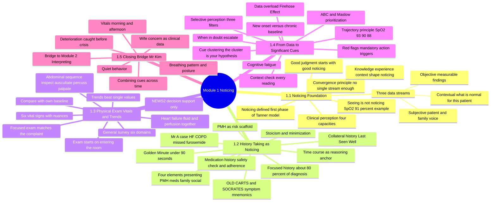
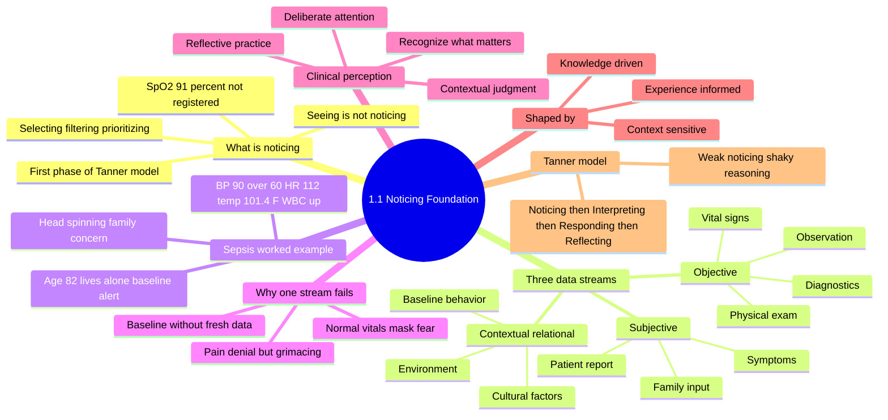
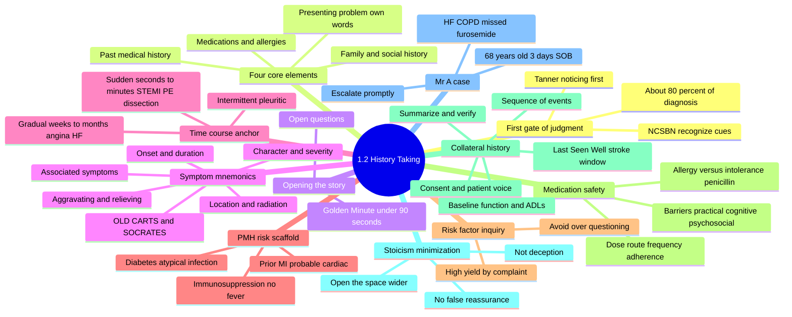
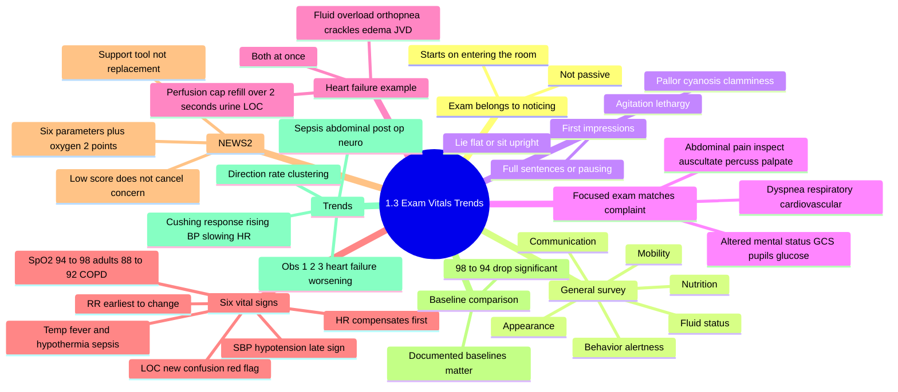
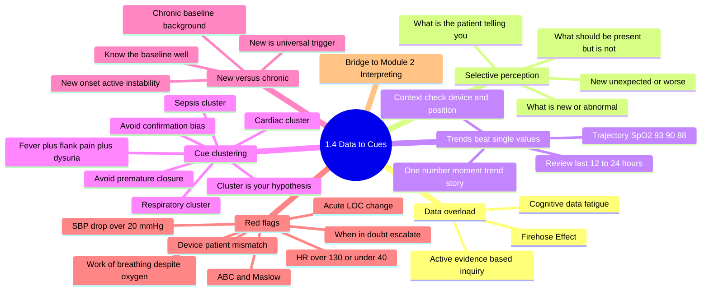
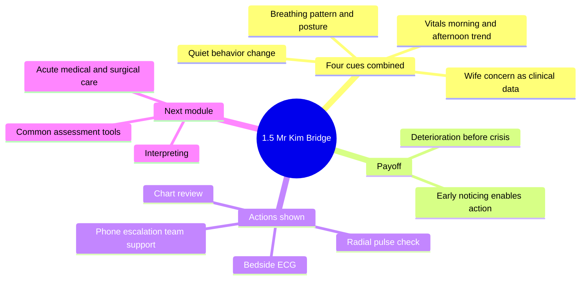

# Study Guide — Module 1: Noticing

**Course:** NURS5602 Clinical Reasoning in Practice
**Module:** Module 1 — Noticing (Videos 1.1–1.5)
**Lecturer:** Polly Li — Associate Professor, School of Nursing, HKU (pwcli@hku.hk)
**Institution:** School of Nursing, LKS Faculty of Medicine, The University of Hong Kong (HKU Med)

---

## How to Use This Guide

- **Read in order first** — Chapters 1–5 follow the videos 1.1–1.5 in teaching sequence; later chapters build on earlier ones.
- **Use the mindmaps for big-picture recall.** Each chapter has a Mermaid mindmap plus a plain indented outline (identical content) for readers whose Markdown viewer does not render Mermaid.
- **Master tables live in the Cross-Cutting Synthesis chapter** — mnemonics, red flags, data streams, vital signs, and all case studies are gathered there for pre-exam scanning.
- **Finish with Rapid Revision** — a one-page bullet summary plus 10 self-test questions with answers.
- **Verbatim quotes** from the voiceover are set in quotation marks — these are worth memorizing word-for-word.
- **All numbers and thresholds matter.** Every threshold given in the lectures (e.g., SpO₂ 94–98% vs 88–92%, SBP drop >20 mmHg, HR >130/<40, <90 seconds, ~80%, 12–24 h) is preserved and examinable.

---

## Module Overview

### Module Mindmap

### Plain-Outline Version

- **Module 1: Noticing**
  - **1.1 Noticing Foundation**
    - Noticing defined — first phase of Tanner's model
    - Seeing ≠ noticing (SpO₂ 91% example)
    - Three data streams
      - Subjective — patient & family voice
      - Objective — measurable findings
      - Contextual — what is normal for *this* patient
    - Convergence principle — no single stream is enough
    - Clinical perception — four capacities
    - Knowledge, experience, context shape noticing
    - "Good judgment starts with good noticing"
  - **1.2 History-Taking as Noticing**
    - Focused history — ~80% of diagnosis
    - Four elements — presenting problem, PMH, medications, family/social
    - Golden Minute — under 90 seconds
    - OLD CARTS & SOCRATES symptom mnemonics
    - Time course as reasoning anchor
    - PMH as risk scaffold
    - Medication history — safety check & adherence
    - Collateral history — "Last Seen Well"
    - Stoicism & minimization
    - Mr. A case — HF, COPD, missed furosemide
  - **1.3 Physical Exam, Vitals & Trends**
    - Exam starts on entering the room
    - General survey — six domains
    - Focused exam matches the complaint
    - Heart failure — fluid & perfusion together
    - Abdominal sequence — inspect → auscultate → percuss → palpate
    - Six vital signs with nuances
    - NEWS2 — decision support only
    - Compare with own baseline
    - Trends beat single values
  - **1.4 From Data to Significant Cues**
    - Data overload — Firehose Effect
    - Cognitive fatigue
    - Selective perception — three filters
    - Trajectory principle — SpO₂ 93→90→88
    - Context-check every reading
    - Cue clustering — "the cluster is your hypothesis"
    - New-onset vs chronic baseline
    - Red flags — mandatory action triggers
    - ABC & Maslow prioritization
    - "When in doubt, escalate"
  - **1.5 Closing Bridge — Mr. Kim**
    - Combining cues across time
    - Vitals morning + afternoon
    - Breathing pattern & posture
    - Quiet behavior
    - Wife's concern as clinical data
    - Deterioration caught before crisis
    - Bridge to Module 2 — Interpreting

---

# Chapter 1 — Video 1.1: Noticing — The Foundation of Clinical Judgment

## 1.1 Overview & Learning Objectives

**Length:** ~6.6 minutes. This opening session establishes the conceptual foundation of the whole module: what "noticing" means in Tanner's Clinical Judgment Model, why it is different from merely collecting data, and how three data streams (subjective, objective, contextual) must converge to support safe clinical judgment.

**After this chapter you should be able to:**

1. Define noticing as the first phase of Tanner's Clinical Judgment Model and explain why seeing a value is not the same as noticing it.
2. List and define the four phases of Tanner's model and explain why each phase depends on the quality of the one before it.
3. Name and describe the three data streams of noticing, with examples of each.
4. Explain the convergence principle — why relying on a single data stream is clinically risky.
5. Describe the four capacities of clinical perception and the three qualities that shape what a nurse notices.
6. Apply the three-stream framework to a case (the 82-year-old with confusion) and explain how streams combine to suggest sepsis.

## 1.2 What Is Noticing?

The lecture opens with the central claim: **before you can make sense of a situation or decide what to do, you first need to notice what actually matters.**

Noticing is the **first phase of Tanner's Clinical Judgment Model** — the ability to perceive what is clinically important in a given situation. Critically, it is **not simply collecting data**. Noticing means **selecting, filtering, and prioritizing** information based on clinical knowledge, experience, and the patient's context.

The lecturer gives the defining example: *"You can record a set of vital signs, but if you do not recognize that one of them is concerning, then you have not really completed the noticing phase."* The slide reinforces this with a green callout: **a nurse who sees an oxygen saturation of 91% but does not notice it as a concern has not truly completed the Noticing phase.** The slide illustration shows a monitor reading SpO₂ 92, HR 145 — data that is visibly present but only clinically useful if it is *noticed*.

> **Core line to remember:** "Noticing is about spotting what matters, not just seeing everything."

**Seeing ≠ noticing.** The data can be "there" while the noticing "has not happened yet."

## 1.3 The Three Data Streams

### Stream 1 — Subjective Data

Information reported by the patient or family — what they **feel, experience, and describe** in their own words. This stream is the patient's own voice and is essential to holistic assessment. Components:

- **Patient Report** — pain level, nausea, dizziness, shortness of breath: symptoms as experienced and communicated directly by the patient.
- **Family Input** — behavioral changes, caregiver concerns, and observations from the home environment that the patient may not report.
- **Symptoms** — fatigue, anxiety, appetite changes, sleep disruption: subjective experiences that inform the clinical picture.

Audio-only nuances: subjective data is "not always measurable," but it is essential because "it tells us what the experience is like from the patient's point of view." Small symptoms (fatigue, poor sleep, loss of appetite) "may seem small on their own, but they help us understand the bigger picture."

### Stream 2 — Objective Data

Measurable, observable findings gathered through **examination, monitoring, and testing**. Unlike subjective data, these findings can be quantified, documented, and compared across time. Components:

- **Observation** — skin color, respiratory effort, level of consciousness: what the nurse directly sees and documents at the bedside.
- **Physical Exam** — heart sounds, lung auscultation, abdominal assessment: hands-on findings that reveal physiological status.
- **Vital Signs** — temperature, BP, HR, SpO₂, respiratory rate: measurable parameters that track patient stability over time.
- **Diagnostics** — labs, imaging, ECG, cultures: confirmatory data that lends precision to the clinical picture.

Audio-only nuances: objective data "gives us evidence that can be tracked over time and communicated clearly to the rest of the team" — an explicit team-communication function. "If subjective data tells us how the patient is experiencing the problem, objective data helps show us what is happening physiologically."

### Stream 3 — Contextual & Relational Data

Contextual data answers the question: **"What is normal for *this* patient?"** It situates clinical findings within the patient's unique history, culture, relationships, and environment — and it is often the stream most easily overlooked. Components:

- **Baseline Behavior** — how does this patient usually act, respond, or communicate? **Deviation from personal baseline is often the earliest indicator of deterioration.**
- **Cultural Factors** — language, beliefs, health practices, and family roles shape how patients express symptoms and engage with care; context the chart may not capture.
- **Environment** — home safety, support systems, and socioeconomic context influence both the patient's risk profile and realistic care planning options.

Audio-only nuances: "A small change from baseline may be an early warning sign, even before the numbers look dramatic." Context includes culture, language, beliefs, family roles, and living situation — "all these things shape how symptoms are expressed, how care is understood, and what care plans are realistic." And: **"Without context, even accurate clinical data can be misunderstood."**

## 1.4 Worked Example — The Three Streams in Action (82-Year-Old With Confusion)

**Scenario:** a patient admitted with **increased confusion**. Each stream contributes a different, essential piece:

| Stream | Data |
|---|---|
| **1 Subjective** | Patient: *"I feel like my head is spinning."* Family: he is *"not acting like himself."* |
| **2 Objective** | **BP 90/60, HR 112, temp 101.4 °F, WBC elevated** on labs. |
| **3 Contextual** | Patient is **82, lives alone**; baseline is **alert and oriented ×3**. |

**Conclusion (slide callout):** together, these streams point toward **possible sepsis** — "a conclusion no single stream could reliably support alone." The lecturer: "We are no longer just looking at confusion as a vague symptom. We start to see a pattern that could suggest something serious, like sepsis. That is the power of noticing across multiple data streams."

## 1.5 Why One Stream Isn't Enough

Clinical risk increases when nurses rely on only one data stream. Each stream alone is incomplete; convergence across all three supports safer, more defensible judgment.

- **Subjective alone fails:** a patient denies pain but is **grimacing and guarding** — objective data reveals the truth that words conceal. (Audio: a patient may say they are fine even when their nonverbal cues suggest otherwise.)
- **Objective alone fails:** normal vitals may mask a patient's fear, or a family's concern about subtle behavioral changes that haven't yet altered the numbers. "The numbers may still look normal while the patient or family can tell that something is off."
- **Context alone fails:** knowing a patient's baseline is essential, but "without current subjective and objective data, you cannot detect or measure change."

> **Verbatim:** "Each stream has limits on its own. Safe clinical judgment comes from bringing them together, not treating them separately."

## 1.6 Noticing Is Perception, Not Just Collection

The slide presents a **"Clinical Perception"** diagram of four capacities feeding upward:

1. **Recognize What Matters**
2. **Contextual Judgment** (making sense of data in context)
3. **Deliberate Attention** (paying attention on purpose)
4. **Reflective Practice** (learning through reflection)

What a nurse notices is shaped by three qualities:

- **Knowledge-Driven** — pathophysiology and pharmacology shape what stands out in the data stream.
- **Experience-Informed** — pattern recognition develops over time and deepens through structured reflection.
- **Context-Sensitive** — what is significant for one patient may be entirely normal for another; the same sign or symptom may mean very different things in different patients.

Audio addition: "When two students look at the same patient and notice different things, that is not unusual. It usually reflects differences in knowledge, experience, and contextual understanding."

## 1.7 Connecting Noticing to Tanner's Model

Noticing is the **entry point** for all subsequent clinical reasoning. Without accurate Noticing, Interpretation and Response are built on an incomplete or misleading foundation. **Each phase depends on the quality of the one before it.**

| Phase | Definition (slide) |
|---|---|
| **Noticing** | Perceiving and selecting clinically relevant cues from the patient's situation. |
| **Interpreting** | Making meaning from the cues — reasoning about what they indicate clinically. |
| **Responding** | Acting on the interpretation — delivering timely, appropriate nursing interventions. |
| **Reflecting** | Evaluating outcomes and learning from the clinical encounter to refine future judgment. |

> **Verbatim:** "If the noticing is weak, the rest of the process becomes shaky too. But if the noticing is accurate and thoughtful, it gives the rest of your clinical reasoning a much stronger foundation."

## 1.8 Chapter 1 Summary — Four Key Principles

1. **Noticing Is Active Perception** — it requires clinical knowledge, not just observation: "you must know what matters before you can see what matters."
2. **Three Data Streams Converge** — subjective, objective, and contextual data must be integrated together for safe and complete clinical judgment.
3. **Single-Stream Thinking Is Risky** — each stream alone can mislead; convergence across all three reduces clinical error and supports defensible decisions.
4. **Context Defines Significance** — what is clinically important depends entirely on the individual patient's baseline, situation, and history.

> **Closing aphorism (verbatim): "Good judgment starts with good noticing."**

## 1.9 Chapter Mindmap

### Plain-Outline Version

- **1.1 Noticing Foundation**
  - What is noticing
    - First phase of Tanner's model
    - Selecting, filtering, prioritizing
    - Seeing ≠ noticing
    - SpO₂ 91% not registered
  - Three data streams
    - Subjective — patient report, family input, symptoms
    - Objective — observation, physical exam, vital signs, diagnostics
    - Contextual/relational — baseline behavior, cultural factors, environment
  - Sepsis worked example
    - "Head spinning"; family concern
    - BP 90/60, HR 112, temp 101.4 °F, WBC elevated
    - Age 82, lives alone, baseline alert & oriented ×3
  - Why one stream fails
    - Pain denial but grimacing/guarding
    - Normal vitals mask fear
    - Baseline without fresh data
  - Clinical perception — recognize what matters, contextual judgment, deliberate attention, reflective practice
  - Shaped by — knowledge-driven, experience-informed, context-sensitive
  - Tanner's model — Noticing → Interpreting → Responding → Reflecting; weak noticing ⇒ shaky reasoning

## 1.10 Key Terms

| Term | Definition |
|---|---|
| **Noticing** | First phase of Tanner's Clinical Judgment Model: the ability to perceive what is clinically important in a given situation; selecting, filtering, and prioritizing information based on knowledge, experience, and patient context — not mere data collection. |
| **Tanner's Clinical Judgment Model** | Four phases — Noticing → Interpreting → Responding → Reflecting; each phase depends on the quality of the one before it. |
| **Subjective data** | Information reported by patient or family — feelings, experiences, descriptions (patient report, family input, symptoms). |
| **Objective data** | Measurable findings via examination, monitoring, and testing (observation, physical exam, vital signs, diagnostics); quantifiable and comparable over time. |
| **Contextual & relational data** | Answers "What is normal for *this* patient?" — baseline behavior, cultural factors, environment; most easily overlooked stream. |
| **Deviation from baseline** | A change from the patient's usual state; often the earliest indicator of deterioration, even before numbers look dramatic. |
| **Convergence principle** | No single stream is sufficient; integrating all three supports safer, more defensible judgment. |
| **Clinical perception** | Four capacities: recognize what matters, contextual judgment, deliberate attention, reflective practice. |
| **Interpreting** | Tanner phase 2 — making meaning from cues; reasoning about what they indicate clinically. |
| **Responding** | Tanner phase 3 — acting on the interpretation with timely, appropriate nursing interventions. |
| **Reflecting** | Tanner phase 4 — evaluating outcomes and learning from the encounter to refine future judgment. |
| **Alert and oriented ×3** | Baseline description meaning oriented to person, place, and time — used as the contextual anchor in the sepsis case. |

## 1.11 Memory Hooks & Exam Pointers

- **"Good judgment starts with good noticing"** — the module's signature closing aphorism; expect it as a quote-recognition item.
- **Seeing ≠ noticing:** the SpO₂ 91% example is the classic test of whether you understand the definition.
- **Three streams = S-O-C:** Subjective, Objective, Contextual. Remember that contextual is "most easily overlooked."
- **"Each one has blind spots"** — memorize one failure example per stream: pain denial (subjective), normal vitals masking fear (objective), baseline without fresh data (context).
- **The sepsis case numbers are fixed:** BP 90/60, HR 112, temp 101.4 °F, elevated WBC, age 82, lives alone, baseline A&O ×3 — be ready to reproduce them.
- **"Deviation from personal baseline is often the earliest indicator of deterioration"** — high-yield definition.
- **Order matters:** Noticing is the *entry point*; "if the noticing is weak, the rest of the process becomes shaky."
- **Two students, same patient, different noticing** = differences in knowledge, experience, context — a likely short-answer question.

---

# Chapter 2 — Video 1.2: History-Taking as a Noticing Skill

## 2.1 Overview & Learning Objectives

**Length:** ~12.1 minutes. **Core thesis:** focused history-taking is the nurse's primary "noticing" instrument — the first phase of clinical judgment (Tanner's model / NCSBN Clinical Judgment Model) — and skilled questioning (including time-course analysis, collateral history, and drawing out stoic patients) is what converts raw patient data into safe clinical decisions.

**After this chapter you should be able to:**

1. Explain why history-taking is a *reasoning skill*, not just a communication task.
2. List the four core elements of a focused nursing history and explain why depth varies by situation.
3. Apply the "Golden Minute" principle and open questions at the start of an interview.
4. Use OLD CARTS / SOCRATES to analyze any symptom across its key dimensions.
5. Use time course (onset, duration, progression, temporal pattern) to judge urgency and rank differentials, including the three chest-pain archetypes.
6. Explain how PMH acts as a "risk scaffold" that changes what new cues mean.
7. Take a complete medication history (including adherence and barriers) as a patient-safety intervention.
8. Conduct structured collateral history using the four domains, including "Last Seen Well."
9. Recognize stoicism/minimization and respond with communication strategies that open the conversation wider.

## 2.2 History-Taking as the First Gate of Clinical Judgment

The session reframes history-taking: "Instead of treating it as just a routine checklist, I want you to see it as one of the main ways nurses actually notice what is going on with a patient."

Both frameworks put assessment first: **Tanner's model** frames clinical judgment in four phases — **Noticing → Interpreting → Responding → Reflecting** — and the **NCSBN Clinical Judgment Model** similarly begins with **"Recognize Cues."** Both identify assessment — including history-taking — as **the essential first gate through which all subsequent reasoning must pass**. As the lecturer puts it: "If our noticing is weak, everything that follows is built on shaky ground."

**What feeds the Noticing phase** (title slide, right panel):

- Patient health history (subjective data)
- Medical records and prior assessments
- Physical environment and behavior
- Family and collateral accounts

Footer: "A well-taken history provides **the majority of data** needed for diagnosis and care planning — making it the primary channel through which nurses notice subtle, clinically important cues before they escalate." The audio adds: "A well-taken history often gives us most of the information we need to understand the problem before the situation escalates."

## 2.3 Why Focused History Matters

A **focused history** is targeted, purposeful questioning about the current problem and directly relevant background — guided by the nurse's immediate clinical concerns rather than an exhaustive life review. Research and clinical textbooks consistently affirm that a thorough history can supply up to **~80% of the information** needed to form a clinical diagnosis or nursing care plan.

Three numbered feature cards (slide):

1. **Directs Attention** — filters the flood of available data down to what is clinically salient right now.
2. **Detects Red Flags** — surfaces early warning patterns that might otherwise be buried in routine conversation.
3. **Supports Safe Prioritization** — enables nurses to rank concerns and escalate care decisions with confidence and evidence.

> **Verbatim:** "Good focused questioning helps direct your attention, detect red flags, and prioritize care safely. In other words, it helps you cut through all the noise and notice what is clinically important right now. That is what makes history taking a reasoning skill, not just a communication task."

## 2.4 Four Core Elements of a Focused Nursing History

The depth and selection of each component are shaped by acuity, clinical setting, and professional judgment — "deciding *what to notice first* is itself a clinical skill."

1. **Presenting Problem** — the patient's own description of why they sought care today ("why the patient came in today, in their own words").
2. **Past Medical History** — prior diagnoses, hospitalizations, surgeries, and chronic conditions; "previous diagnosis and chronic conditions change how we interpret new symptoms."
3. **Medications & Allergies** — prescribed, OTC, herbal remedies — with dose, route, frequency, and adherence; "essential for safety and for understanding what may be causing the current presentation."
4. **Family & Social History** — genetic risk, living situation, functional status, and support systems as relevant; these "often shape both risk and care planning."

> **Key point (verbatim):** "You do not explore all of these in exactly the same depth every time. You decide what matters first based on the situation."

## 2.5 Opening the Story: Open Questions & the Golden Minute

The **presenting problem** is the patient's own, unfiltered account of what brought them in — "chest pain," "I can't catch my breath," "I just don't feel right" — captured, as the audio says, "before we reshape it into medical language." It is the starting point from which all focused questioning flows.

- **Start with open questions:** *"Tell me what brought you in today."* This simple invitation signals that the patient's own words matter and that **you are prepared to listen** — not just check boxes.
- **The "Golden Minute":** allow a brief period of **uninterrupted free narration** before moving to focused follow-ups. Studies show most patients finish their opening statement in **under 90 seconds** — and interrupting early causes key information to go unshared.

> **Verbatim:** "If we allow a short stretch of uninterrupted speaking at the start, patients often tell us more than we expect. If we interrupt too quickly, we may miss the cue that would have pointed us in the right direction."

## 2.6 Symptom Analysis Using Mnemonics (OLD CARTS / SOCRATES)

Structured memory aids ensure no dimension of a symptom is overlooked, creating a reproducible framework for comprehensive, focused analysis. The five dimensions on the slide:

- 🕐 **Onset & Duration** — when did it start? How long has it lasted? Sudden or gradual?
- 📍 **Location & Radiation** — where is it? Does it move or radiate to another area?
- 〰 **Character & Severity** — what does it feel like? On a 0–10 scale, how severe?
- ⊕ **Aggravating & Relieving** — what makes it worse or better? Any triggers?
- 🔗 **Associated Symptoms** — what else is happening at the same time?

Footer: "Mnemonics like **OLD CARTS** and **SOCRATES** are interchangeable frameworks — the goal is systematic, consistent symptom analysis, not memorizing acronyms."

> **Verbatim:** "The goal is not to memorize a fancy acronym. The goal is to make sure you cover the key symptom dimensions. When it started, where it is, what it feels like, how severe it is, what makes it better or worse, and what else is happening at the same time. These questions help you turn a vague complaint into a clinically useful pattern."

## 2.7 Time Course: The Reasoning Anchor

"How a symptom evolves over time is one of the most powerful discriminators in clinical reasoning. The nurse's job is to trace the **trajectory** — not just the snapshot." (Slide 5)

- **Acute vs. chronic** onset changes urgency dramatically.
- **Stepwise deterioration** may suggest vascular etiology.
- **Fluctuating symptoms** may point to metabolic or inflammatory causes.
- **Intermittent patterns** with triggers often indicate reversible pathology.

**Linking patterns to noticing:** when a nurse tracks symptom evolution — asking *"When was the last time you felt completely normal?"* or *"How has this changed over the past week?"* — they are actively searching for patterns that indicate urgency and guide hypothesis formation. "Pattern recognition grounded in time course is what distinguishes a nurse who *collects* data from one who *interprets* it in real time."

> **Verbatim:** "One of the most useful questions in clinical assessment is actually very simple: How has this changed over time? … Time course is not just background information. It is one of the clues that helps shape your clinical judgment."

## 2.8 Past Medical History as Risk Context

**Past medical history (PMH)** encompasses prior diagnoses, hospitalizations, surgeries, chronic conditions, and relevant developmental or mental health history. "It is not background filler — it is the **risk scaffold** on which you evaluate every new cue." (Slide 6)

- ❤ **Cardiovascular History:** a prior MI changes the significance of new chest discomfort entirely — from *possible* to *probable* cardiac cause.
- 💧 **Diabetes & Metabolic:** uncontrolled diabetes elevates risk for infection, neuropathy, and atypical presentations of acute illness.
- 🛡 **Immunosuppression:** patients on immunosuppressants may present with infections **without classic signs like fever**, demanding heightened vigilance.

> **Verbatim:** "When you ask about past history, you are really asking: what risks, vulnerabilities, or altered presentations do I need to keep in mind for this patient?"

## 2.9 Focused Risk Factor Inquiry

Rather than exhaustive checklists, focused risk factor inquiry means selecting **high-yield questions aligned with the presenting problem** — using professional judgment to refine hypotheses efficiently.

**Examples by presenting problem (slide 7):**

| Presenting problem | High-yield risk factors |
|---|---|
| **Chest pain** | Smoking history, family cardiac history, hypertension, hyperlipidemia |
| **Shortness of breath** | Occupational exposures, asthma, prior pulmonary events |
| **Abdominal pain** | Alcohol use, reproductive history, recent travel, prior GI surgeries |
| **Confusion/delirium** | Baseline cognitive function, recent infections, medication changes |

**Noticing through selection:** "Noticing is not passive. Choosing *which* risk factors to explore is an active clinical reasoning act — it reflects your working hypothesis and sharpens your ability to recognize which cues truly matter. Avoid the trap of collecting every possible risk factor; **over-questioning can obscure the signal in the noise and erode patient trust.**"

## 2.10 Medication History & Patient Safety

A complete medication history includes **all prescribed medications, OTC products, herbal and supplement use, and known allergies** — captured with **dose, route, and frequency**. "It is not a formality; it is a direct patient safety intervention." (Slide 8)

- **Drug Interactions & Contraindications** — polypharmacy is a leading contributor to adverse events; identifying concurrent medications helps flag dangerous combinations before harm occurs.
- **Interpreting Current Symptoms** — new symptoms may be adverse drug effects, withdrawal syndromes, or toxicity; knowing what the patient is — or recently was — taking is essential for differential reasoning.
- **Allergy Documentation** — distinguish true allergic reactions from intolerances. A patient who says *"I can't take penicillin"* needs further exploration — what exactly happened?

> **Verbatim:** "Medication history helps us spot interactions, contraindications, side effects, withdrawal, or toxicity. It also helps us clarify allergy histories, because sometimes what patients call an allergy is actually an intolerance or side effect. So this part of the history can directly change what we do next."

## 2.11 Exploring Adherence & Barriers

Non-adherence is one of the most clinically important — and most underreported — cues in chronic disease management. "Patients rarely volunteer it; skilled questioning uncovers it." Ask in a way that feels safe, not blaming. **Opening scripts (slide 9):**

- *"Many people find it hard to take medications every day — how does that go for you?"*
- *"How often do you find yourself missing doses?"*
- *"Have you started or stopped anything recently?"*
- *"Do you use any aids like a pill box or phone reminder?"*

**Why it matters for noticing:** non-adherence can explain **poor control of chronic conditions, unexpected presentations, or rebound symptoms**. Barriers may be **practical** (cost, side effects), **cognitive** (forgetting, complexity), or **psychosocial** (denial, fear). Identifying the barrier is the first step toward an actionable, individualized care plan.

## 2.12 Collateral History

A **collateral history** is information obtained from family members, caregivers, or witnesses — either because the patient cannot provide a reliable history, or to supplement and verify their account. "It is not optional; for many patient populations, it is indispensable." (Slide 10)

- **When to seek it** — altered cognition, communication barriers, acute confusion, children, patients with dementia or psychiatric illness, or any situation where self-report alone seems incomplete.
- **What it adds** — baseline cognition and functional status, social circumstances, behavior changes, usual medications and adherence — all critical for diagnosing **delirium vs. dementia** and planning safe discharge.
- **What to protect** — always obtain patient consent where possible and be mindful of confidentiality. **Collateral sources complement — they do not override — the patient's own voice.** (Audio: it should "support the assessment, not erase the patient's own voice.")

### Structured Collateral Questioning — Four Domains (Slide 11)

1. **01 "Last Seen Well"** — establish the exact time the patient was last at their baseline — critical for conditions like **stroke** where intervention windows are time-sensitive.
2. **02 Sequence of Events** — have the informant walk you through what happened, in order — preserve the narrative rather than asking yes/no questions.
3. **03 Baseline Function & ADLs** — mobility, continence, cognition, and home environment — to distinguish acute change from chronic baseline.
4. **04 Summarize & Verify** — reflect the account back: *"So what you're telling me is…"* — checking for accuracy and filling gaps before relying on the account for clinical decisions. (Audio: this last step "helps catch misunderstandings before you act on the information.")

## 2.13 Recognizing Stoicism & Minimization

Some patients consistently **downplay or dismiss their symptoms** — giving brief answers, describing significant discomfort as "nothing serious," or framing suffering as not worth mentioning. "This is not deception; it reflects culture, personality, fear of burdening others, or prior negative healthcare experiences." (Slide 12)

**How it presents:**

- One-word or minimal answers
- Deflection: *"I'm fine, really"*
- Normalizing serious symptoms: *"I've had it for years"*
- Reluctance to use high severity ratings
- Visible distress that contradicts verbal report

**The clinical risk:** "Closed questions, time pressure, and premature reassurance from the clinician can further suppress disclosure in stoic patients — creating a cycle where important clinical information is never surfaced. The nurse must actively work against this dynamic."

> **Verbatim:** "Part of noticing is recognizing when the words do not fully match the situation."

## 2.14 Communication Strategies for Minimizing Patients

"When a patient minimizes symptoms, the clinical response is to **open the conversational space wider** — not to push harder with direct questions, which often produces shorter answers." (Slide 13)

- **Open-Ended Prompts** — *"Help me understand what this pain is like for you."* / *"Tell me more about how this has affected your day-to-day life."* These invitations shift the balance of the conversation back to the patient.
- **Gentle Clarification** — *"You say it's 'nothing much' — can you walk me through what happens when it's at its worst?"* This technique names the minimization without confronting it, and redirects toward observable specifics.
- **Reflection & Validation** — mirror what the patient says back and acknowledge the experience: *"It sounds like you've been managing this for a long time."* Validation reduces defensiveness and increases disclosure.

### Balancing Empathy & Clinical Precision (Slide 14)

"Therapeutic communication and rigorous clinical inquiry are not competing priorities — they are mutually reinforcing. Empathy creates the relational safety that allows patients to share what they would otherwise withhold."

- **Empathy without false reassurance:** *"It sounds like you've been coping with a lot on your own."* / *"I can see this has been hard to talk about."* Avoid statements like *"I'm sure it's nothing"* — these mirror the patient's minimization and close down further disclosure.
- **Attending to what isn't said:** in stoic patients, noticing extends beyond words. Watch for **nonverbal signs** of pain or distress; **inconsistencies** between verbal report and behavior; **subtle hesitations** or topic avoidance; **caregiver or family reactions** during the interview. "The nurse's sensitivity to these signals is itself a clinical assessment skill."

> **Verbatim:** "A patient who feels heard is more likely to share the details that matter. That is why empathic communication helps strengthen assessment rather than weaken it. … Part of good noticing is watching for the gap between what is said out loud and what may still be sitting underneath."

## 2.15 Time Course as a Diagnostic Cue — The Three Chest-Pain Archetypes

"Of all the dimensions captured in symptom analysis, **time course** — onset, duration, temporal pattern, and progression — is among the most discriminating in forming and ranking differential diagnoses." (Slide 15)

| # | Pattern | Time course | Suggests | Urgency |
|---|---|---|---|---|
| 1 | **Sudden severe chest pain** | Onset in seconds to minutes | Aortic dissection, pulmonary embolism, STEMI | **Immediate escalation** |
| 2 | **Gradual exertional discomfort** | Worsening over weeks to months with exertion | Stable angina or heart failure | **Urgent but not emergent** workup |
| 3 | **Intermittent pleuritic pain** | Episodic, positional, worse with breathing | Pleuritis, pneumonia, or PE | Temporal pattern directs imaging priority |

Footer: "These distinctions — made through focused questioning, not imaging — drive triage decisions, escalation calls, and the order in which interventions are prepared." The audio adds: "These distinctions often come from focused questioning before any test result comes back. So by asking carefully about time course, nurses are already helping shape triage, escalation, and early intervention priorities."

## 2.16 Case Vignette — Mr. A (Integrating Time Course)

**Case (slide 16):** Mr. A, **68 years old**, presents with **three days of progressively worsening shortness of breath**. His daughter (collateral) reports he was "fine" four days ago. He has a history of **heart failure and COPD**, takes **furosemide**, and admits he "probably missed a few doses this week."

Three chevron steps:

1. **Recognize Time Course** — subacute onset over 3 days; previously at baseline per collateral — this is a **new change, not chronic decompensation**.
2. **Layer Risk Context** — known HF + COPD + missed diuretic doses = high probability of **acute decompensated HF**; **COPD exacerbation** also on the differential.
3. **Prioritize & Escalate** — nurse recognizes cues, initiates respiratory assessment, positions patient, prepares for provider escalation and potential diuresis.

> **Verbatim:** "Straight away, we are combining time course, collateral history, and medication adherence. That helps us think more clearly about likely causes and urgency. **The nurse's job is not to make the final diagnosis alone, but to recognize the pattern, begin appropriate assessment, and escalate promptly.**"

**Documentation phrase to copy:** *"Symptom onset approximately 72 hours ago, progressive, from baseline per family"* — ensures every team member understands the illness trajectory, not just the current snapshot.

## 2.17 Chapter 2 Summary — Three Take-Home Messages

1. **Focused History Is Your Primary Noticing Tool** — a well-conducted focused history can provide up to **~80%** of the data needed for clinical diagnosis and care planning — "the most powerful assessment instrument available before any test is ordered."
2. **Time Course Is Central to Safe Clinical Judgment** — structured symptom analysis (especially onset, duration, and progression) is what allows nurses to distinguish urgency levels, rank hypotheses, and escalate at the right moment.
3. **Skilled Questioning Surfaces Hidden Cues** — therapeutic communication, collateral history, and attention to nonverbal signals uncover clinically significant information in patients who minimize, cannot communicate, or need an advocate to speak for them.

> **Closing aphorism (verbatim): "A strong history is not extra. It is core clinical work."**

**Bridge to practice (slide 18):** reflection prompts on minimizing patients, time course, and collateral history — plus the assignment: *bring one example from your next clinical shift where focused history-taking changed — or could have changed — your clinical priorities, to share at post-conference.*

## 2.18 Chapter Mindmap

### Plain-Outline Version

- **1.2 History-Taking**
  - First gate of judgment — Tanner Noticing first; NCSBN "Recognize Cues"; ~80% of diagnosis
  - Four core elements — presenting problem (own words), PMH, medications & allergies, family & social history
  - Opening the story — open questions; Golden Minute under 90 seconds
  - Symptom mnemonics — onset & duration; location & radiation; character & severity; aggravating & relieving; associated symptoms; OLD CARTS & SOCRATES
  - Time course anchor — sudden (seconds–minutes: STEMI/PE/dissection); gradual (weeks–months: angina/HF); intermittent pleuritic
  - PMH risk scaffold — prior MI → probable cardiac; diabetes → atypical infection; immunosuppression → no fever
  - Risk factor inquiry — high-yield by complaint; avoid over-questioning
  - Medication safety — dose/route/frequency/adherence; allergy vs intolerance (penicillin); barriers practical/cognitive/psychosocial
  - Collateral history — Last Seen Well (stroke window); sequence of events; baseline function & ADLs; summarize & verify; consent & patient voice
  - Stoicism/minimization — not deception; open the space wider; no false reassurance
  - Mr. A case — 68 years old, 3 days SOB, HF + COPD, missed furosemide, escalate promptly

## 2.19 Key Terms

| Term | Definition |
|---|---|
| **Focused history** | Targeted, purposeful questioning about the current problem and directly relevant background — not an exhaustive life review; supplies up to ~80% of information needed for diagnosis/care planning. |
| **NCSBN Clinical Judgment Model** | Begins with "Recognize Cues" — parallel to Tanner's Noticing phase. |
| **Presenting problem** | The patient's own, unfiltered account of what brought them in; starting point for all focused questioning. |
| **Golden Minute** | Uninterrupted free narration at interview start; most patients finish in < 90 seconds; early interruption loses key information. |
| **OLD CARTS / SOCRATES** | Interchangeable symptom-analysis mnemonics covering onset, location/radiation, character/severity, aggravating/relieving factors, associated symptoms, time course. |
| **Time course** | Onset, duration, temporal pattern, progression — the most discriminating symptom dimension for ranking differentials. |
| **Past medical history (PMH)** | Prior diagnoses, hospitalizations, surgeries, chronic conditions, developmental/mental health history — the "risk scaffold" for evaluating new cues. |
| **Focused risk factor inquiry** | Selecting high-yield questions aligned with the presenting problem; an active reasoning act ("noticing through selection"). |
| **Complete medication history** | All prescribed meds + OTC + herbal/supplements + known allergies, with dose, route, frequency — a direct patient safety intervention. |
| **Non-adherence** | Underreported cue explaining poor chronic-disease control, unexpected presentations, rebound symptoms; barriers: practical / cognitive / psychosocial. |
| **Collateral history** | Information from family/caregivers/witnesses when self-report is unreliable or incomplete; complements (never overrides) the patient's voice; requires consent & confidentiality. |
| **"Last Seen Well"** | Exact time the patient was last at baseline — critical for time-sensitive conditions (e.g., stroke windows). |
| **Baseline function & ADLs** | Mobility, continence, cognition, home environment — distinguishes acute change from chronic baseline; key for delirium vs dementia. |
| **Stoicism / minimization** | Consistent downplaying of symptoms ("I'm fine, really"; "I've had it for years") rooted in culture, personality, fear of burdening others, or prior negative healthcare experiences — not deception. |
| **Empathy without false reassurance** | Acknowledge experience without minimizing concern; avoid "I'm sure it's nothing," which closes disclosure. |
| **Attending to what isn't said** | Nonverbal distress signs, verbal-behavior inconsistencies, hesitations, topic avoidance, family reactions. |

## 2.20 Memory Hooks & Exam Pointers

- **~80%** — the fraction of diagnostic information a thorough history can supply. The single most quoted number in this chapter.
- **Golden Minute = < 90 seconds** — most patients finish their opening statement in under 90 seconds if uninterrupted.
- **Four elements:** Presenting problem, PMH, Medications & allergies, Family & social history — but **vary the depth** by situation.
- **"Risk scaffold"** — the metaphor for PMH. Prior MI → probable cardiac; diabetes → atypical presentations; immunosuppression → **no fever**.
- **Three chest-pain archetypes:** sudden severe (seconds–minutes → dissection/PE/STEMI → **immediate escalation**); gradual exertional (weeks–months → angina/HF → urgent, not emergent); intermittent pleuritic (positional, worse with breathing → pleuritis/pneumonia/PE).
- **The single most useful question:** "How has this changed over time?"
- **Collateral four domains:** Last Seen Well → Sequence of events → Baseline function & ADLs → Summarize & verify. "Last Seen Well" links to **stroke windows**.
- **Allergy probe:** "I can't take penicillin" → ask *what exactly happened* (true allergy vs intolerance).
- **Never say "I'm sure it's nothing"** — false reassurance reinforces minimization.
- **"A strong history is not extra. It is core clinical work."** — closing aphorism.
- **Nurse's role boundary:** not to make the final diagnosis alone, but to "recognize the pattern, begin appropriate assessment, and escalate promptly."
- **Documentation phrase:** "Symptom onset approximately 72 hours ago, progressive, from baseline per family."

---

# Chapter 3 — Video 1.3: Physical Examination, Vital Signs, and Trends

## 3.1 Overview & Learning Objectives

**Length:** ~8.2 minutes. This session builds on noticing by focusing on **objective clinical cues**. The main message: physical examination and vital signs are **not just tasks to complete** — they are tools that help you recognize what is going on with the patient, how serious it may be, and what needs your attention first.

**After this chapter you should be able to:**

1. Explain why physical examination belongs to the Noticing phase and why noticing begins the moment you enter the room.
2. Perform and describe the general survey across its six domains.
3. Match a focused examination to the presenting complaint (dyspnea, abdominal pain, altered mental status) and justify the abdominal exam sequence.
4. Conduct a heart-failure-focused exam that assesses fluid status AND perfusion simultaneously.
5. State the six core vital-sign parameters and the clinical nuance attached to each.
6. Describe NEWS2 — its components, its uses, and its limits.
7. Apply baseline comparison and trend-based reasoning to detect deterioration earlier than any single threshold would.

## 3.2 Why Physical Examination Belongs to Noticing

"In clinical judgment, **noticing** means actively gathering objective cues — not simply listening to what a patient reports. Physical examination is a structured form of noticing: it transforms what the nurse observes, hears, and measures into clinically meaningful data." (Slide 2)

Critically, **noticing begins the moment the nurse enters the room**. Before a single question is asked, cues are already available: How is the patient sitting? Are they using accessory muscles to breathe? Do they look anxious or confused? These immediate observations shape everything that follows — from which system to examine first to how urgently to act.

> **Slide callout:** "Noticing is not passive. It is a deliberate, skilled act of cue recognition that starts at first contact and continues throughout the encounter."

> **Verbatim:** "Noticing is active. It is not passive. And it definitely does not begin only when you put the cuff on or pick up the stethoscope."

## 3.3 The General Survey

The **general survey** is the holistic, initial observation of the patient as a whole person — beginning at first contact and continuing throughout the assessment. It captures information that more targeted examinations can miss. Six domains (slide 3):

| Domain | What it captures |
|---|---|
| **General Appearance** | Overall impression, dress, hygiene, and grooming — clues to functional status and self-care ability. |
| **Behavior & Alertness** | Orientation, affect, cooperation, agitation, or unusual quietness — indicators of neurological and psychological status. |
| **Mobility** | Gait, posture, use of assistive devices, ease of movement — reflects musculoskeletal and neurological function. |
| **Communication** | Clarity of speech, breath support during speech, ability to answer in full sentences — early respiratory and cognitive cues. |
| **Nutritional Status** | Body habitus, muscle wasting, visible weight loss — context for underlying chronic illness or acute deterioration. |
| **Fluid Status** | Visible edema, dry mucous membranes, skin turgor — rapid indicators of hydration and volume balance. |

The audio frames the general survey as asking yourself: *How does this patient look overall? How are they functioning? Is anything already telling me that something is off?* It is useful because "it helps you see the patient as a person, not just a list of symptoms."

## 3.4 First Impressions That Matter Clinically

"The cues gathered in the first moments with a patient are not vague gut feelings — they are early, objective indicators of acuity that should immediately guide the direction of your assessment." (Slide 4)

**Appearance & respiratory cues:**

- Posture and ability to lie flat vs. sit upright
- Visible work of breathing or accessory muscle use
- Ability to speak in full sentences without pausing
- Pallor, cyanosis, or mottled skin
- Diaphoresis or clamminess

**Neurological & behavioral cues:**

- Alertness, orientation, and responsiveness
- Facial expression — grimacing, flat affect, distress
- Agitation, restlessness, or unusual lethargy
- Hygiene and self-presentation relative to baseline
- Visible edema, particularly in dependent areas

Bottom line (slide): "Each of these cues tells you which systems to examine first. A patient who is breathless and cannot complete a sentence requires a very different immediate focus than a patient who walks in calmly and speaks without effort."

## 3.5 Focused Exam Should Match the Complaint

"Physical examination is not a fixed, identical checklist applied to every patient. Skilled nurses identify the **highest-yield systems** based on the presenting problem and prioritize those first. This is efficient, patient-centered, and clinically safer — because it keeps attention on what is most likely to reveal deterioration." (Slide 5)

- **Dyspnea** — prioritize respiratory and cardiovascular systems: respiratory rate, effort, breath sounds, O₂ saturation, peripheral perfusion, and heart sounds.
- **Abdominal pain** — focus on abdominal inspection, auscultation, percussion, and palpation; assess for guarding, distension, bowel sounds, and hydration.
- **Altered mental status** — prioritize neurological and metabolic assessment: Glasgow Coma Scale, pupils, blood glucose, temperature, and medication review.

> **Verbatim:** "The complaint helps point you toward the highest yield systems, and your assessment should follow that logic."

## 3.6 Example: Focused Examination in Heart Failure

"Heart failure assessment goes well beyond 'listen to the lungs.' It is a **whole-patient fluid and perfusion assessment** requiring integration of multiple systems simultaneously." (Slide 6)

**Respiratory & fluid-overload signs:**

- Respiratory rate and effort; use of accessory muscles
- **Orthopnea** — inability to lie flat without breathlessness
- Lung auscultation for **bibasal crackles**
- Peripheral edema (ankles; sacrum in bed-bound patients)
- **Jugular venous distension** as a bedside volume-status cue

**Perfusion & mental status:**

- Skin temperature and color — cool, pale, or mottled peripheries
- **Capillary refill time (> 2 seconds is significant)**
- Ability to speak in full sentences without pausing
- Level of consciousness and new-onset confusion
- Urine output where monitored

> **Callout (slide):** "HF can present with both fluid overload AND poor perfusion at the same time. Assess both simultaneously — not one or the other."

> **Verbatim:** "A patient with heart failure can be overloaded with fluid and still be poorly perfused. If you only look for one side of the picture, you can miss how sick they really are."

## 3.7 Same Logic, Different Condition: The Abdominal Sequence

"The systems examined change depending on the presenting problem — but the underlying **noticing logic is always the same**: observe the whole patient first, then target the examination to what the complaint most likely involves." (Slide 7)

**Abdominal pain — what to assess:** **Inspect** for distension, visible peristalsis, or surgical scars → **Auscultate** for bowel sound changes before palpation → **Percuss** for tympany or dullness → **Palpate** for tenderness, guarding, rebound, or a palpable mass. Also note vomiting, bowel habits, and hydration status.

**Why sequence matters:** "Auscultation always precedes palpation in the abdomen because palpation can alter bowel sounds. Sequence is not arbitrary — it protects the integrity of your findings and reflects disciplined clinical thinking."

**The noticing principle applied:** "Begin with the broadest observation (general survey), identify the most concerning early cues, then narrow and deepen the examination in the direction the cues are pointing. **The complaint guides the sequence — your judgment guides the depth.**"

## 3.8 Vital Signs as Objective Clinical Cues

"Vital signs are among the most powerful tools in cue recognition — but only when interpreted in context, not treated as a bureaucratic checklist." (Slide 8) The **six core parameters** used in adult deterioration assessment:

| Parameter | Clinical nuance (slide, verbatim) |
|---|---|
| **RR — Respiratory Rate** | "Most sensitive early warning parameter. Often the first vital sign to change in deterioration." |
| **SpO₂ — Oxygen Saturation** | "Target **94–98%** in most adults; **88–92% in COPD**. Trend is critical." |
| **SBP — Systolic BP** | "Hypotension is a **late sign**. Rising or falling trends matter." |
| **HR — Pulse Rate** | "Tachycardia may compensate for low output before BP falls." |
| **Temp — Temperature** | "Both fever and hypothermia are meaningful. Hypothermia may indicate sepsis." |
| **LOC — Consciousness** | "New confusion is a red-flag clinical parameter, not a social observation." |

> **Verbatim (the chapter's core admonition):** "Do not treat vital signs like admin work. Treat them like evidence."

> **Verbatim:** "Blood pressure can stay normal until quite late, so waiting for hypotension can be dangerous. Heart rate may rise first to compensate."

## 3.9 Early Warning Scores — NEWS2

**NEWS2 (National Early Warning Score 2)** is a validated track-and-trigger tool that combines six physiological parameters into a single aggregate score to support escalation decisions. It is widely used across acute care settings. (Slide 9)

**What NEWS2 includes:**

- Respiratory rate
- Oxygen saturation (with COPD scale option)
- Systolic blood pressure
- Pulse rate
- Temperature
- Level of consciousness / new confusion
- **Supplemental oxygen use (scores 2 points)**

**Key principles for practice:**

- A **single severely abnormal parameter** can be clinically significant even when the total aggregate score appears low.
- **Supplemental oxygen requirement is itself a warning sign**, not a reassuring fix.
- NEWS2 **supports** escalation decisions — it does not replace clinical judgment.
- Always **communicate the score alongside your clinical concern**, not instead of it.

> **Callout (slide):** "Early warning scores are decision-support tools. A low score does not override your clinical concern if something does not feel right with the patient."

> **Verbatim:** "Use NEWS2, but do not let it replace your clinical judgment."

## 3.10 Compare With Baseline

"A value that falls within a published 'normal range' can still be a significant clinical cue — if it represents a meaningful departure from **that patient's own usual baseline**. Normal for the population is not the same as normal for the individual." (Slide 10)

- **Oxygenation example:** a patient who typically saturates at **98% on room air** and is now measuring **94%** has dropped 4 points. Technically within range — but clinically significant. **"The change is the signal."**
- **Consciousness example:** a previously alert and oriented patient who is now **drowsy and slow to respond** warrants immediate attention — even without a dramatic vital sign change.
- **Heart failure example:** worsening exercise tolerance, **new orthopnea**, increasing peripheral edema, and declining SpO₂ are all most meaningful when compared directly against the patient's documented baseline.

Bottom line: "This is why accurate, documented baselines matter. Without them, the significance of a change is invisible to the next nurse who reads the chart." (Audio: "If baseline is not recorded clearly, the next nurse may miss the significance of the change.")

## 3.11 Why Trends Matter More Than One Mildly Abnormal Value

**Headline (slide 11): "Direction and clustering — not a single number — reveal deterioration."**

"One mildly abnormal value may be noted and monitored. A **pattern of change across repeated observations** is a different, more urgent clinical signal entirely." The heart failure trajectory:

| Observation | RR | SpO₂ | HR | Other |
|---|---|---|---|---|
| **1** | 20 | 96% | 88 | Mild ankle edema; walking to bathroom independently |
| **2** | 24 | 94% | 96 | Edema worsening; breathless on dressing |
| **3** | 28 | 91% | 108 | Requiring supplemental O₂; orthopneic; **new confusion** |

"Each individual value in Observation 1 might be documented and left unchanged. But seeing all three rows together makes the trajectory unmistakable: this patient is deteriorating. The significance lies in the **direction**, the **rate of change**, and the **clustering of cues** — not in any single measurement viewed in isolation."

> **Verbatim (the core trend question):** "Do not just ask, *Is this number normal?* Ask, *Where is this going?*"

## 3.12 Applying Trend-Based Reasoning Across Practice

"The same pattern-recognition principle applies in every area of acute nursing practice — not only in heart failure." (Slide 12)

- **Sepsis:** rising heart rate, increasing respiratory rate, worsening confusion, and falling BP **in combination** are more alarming than any single parameter alone.
- **Abdominal deterioration:** increasing pain intensity, guarding that was not present before, rising heart rate, and a **silent abdomen** on auscultation together point toward a surgical emergency.
- **Post-operative complications:** subtle trends in blood pressure, urine output, temperature, and wound appearance — tracked over hours — detect internal bleeding or infection before it becomes overt.
- **Neurological deterioration:** declining GCS, pupillary changes, or a rising blood pressure with slowing heart rate (**Cushing's response**) are meaningful only when trended — not sampled once.

> **Closing reflective question (verbatim):** "Am I looking at one borderline value, or am I seeing several cues gradually moving in the wrong direction?"

## 3.13 Chapter Mindmap

### Plain-Outline Version

- **1.3 Exam, Vitals, Trends**
  - Exam belongs to noticing — starts on entering the room; not passive
  - General survey — appearance; behavior & alertness; mobility; communication; nutrition; fluid status
  - First impressions — lie flat vs sit upright; full sentences vs pausing; pallor/cyanosis/clamminess; agitation/lethargy
  - Focused exam matches complaint
    - Dyspnea → respiratory & cardiovascular
    - Abdominal pain → inspect, auscultate, percuss, palpate
    - Altered mental status → GCS, pupils, glucose
  - Heart failure example — fluid overload (orthopnea, crackles, edema, JVD) + perfusion (cap refill > 2 s, urine, LOC); both at once
  - Six vital signs
    - RR — earliest to change
    - SpO₂ — 94–98% adults; 88–92% COPD
    - SBP — hypotension is a late sign
    - HR — compensates first
    - Temp — fever and hypothermia (sepsis) both meaningful
    - LOC — new confusion is a red flag
  - NEWS2 — six parameters plus oxygen (2 points); low score does not cancel concern; support tool, not replacement
  - Baseline comparison — 98→94 drop is significant; documented baselines matter
  - Trends — direction, rate, clustering; Obs 1–3 heart failure worsening; sepsis/abdominal/post-op/neuro applications; Cushing's response (rising BP + slowing HR)

## 3.14 Key Terms

| Term | Definition |
|---|---|
| **General survey** | Holistic, initial observation of the patient as a whole person, from first contact onward; six domains: general appearance, behavior & alertness, mobility, communication, nutritional status, fluid status. Captures what targeted exams can miss. |
| **Highest-yield systems** | The body systems most likely to reveal deterioration given the presenting complaint; prioritized first in a focused exam. |
| **Focused examination** | Exam matched to the complaint — not a fixed identical checklist; the complaint guides the sequence, clinical judgment guides the depth. |
| **Orthopnea** | Inability to lie flat without breathlessness — a fluid-overload/heart-failure cue. |
| **Abdominal exam sequence** | Inspect → Auscultate → Percuss → Palpate; auscultation precedes palpation because palpation can alter bowel sounds. |
| **Six core vital-sign parameters** | RR, SpO₂, SBP, HR, Temp, LOC. |
| **RR** | Most sensitive early warning parameter; often the first vital sign to change in deterioration. |
| **SpO₂ targets** | 94–98% in most adults; 88–92% in COPD; trend is critical. |
| **SBP** | Hypotension is a LATE sign; trends matter more than single values. |
| **HR** | Tachycardia may compensate for low cardiac output before BP falls. |
| **Temperature** | Both fever and hypothermia meaningful; hypothermia may indicate sepsis. |
| **LOC** | New confusion is a red-flag clinical parameter, not a social observation. |
| **NEWS2** | National Early Warning Score 2 — validated track-and-trigger tool aggregating RR, SpO₂ (COPD scale option), SBP, pulse, temp, LOC/new confusion plus supplemental oxygen use (2 points); decision support only — never replaces clinical judgment. |
| **Baseline comparison** | Population-normal ≠ individual-normal; a value within range can be significant if it departs from the patient's documented usual baseline. "The change is the signal." |
| **Trend-based reasoning** | Deterioration revealed by direction, rate of change, and clustering of cues across repeated observations — not by any single number. |
| **Cushing's response** | Rising blood pressure with slowing heart rate (± declining GCS, pupillary changes) — a sign of neurological deterioration, meaningful only when trended. |
| **Capillary refill** | > 2 seconds is significant — a perfusion cue in the heart-failure exam. |

## 3.15 Memory Hooks & Exam Pointers

- **"Treat them like evidence"** — vital signs are not admin work; this is the chapter's most quotable line.
- **Six vitals, six nuances** — learn the one-line nuance for each: RR first to change; SpO₂ 94–98 vs 88–92 COPD; hypotension LATE; HR compensates first; hypothermia can mean sepsis; new confusion = clinical red flag.
- **RR is the most sensitive early warning parameter** — favorite exam fact.
- **SpO₂ targets:** 94–98% most adults; **88–92% in COPD** — do not confuse the two.
- **Abdominal sequence:** Inspect → Auscultate → Percuss → Palpate — auscultate BEFORE palpation because palpation alters bowel sounds.
- **Heart failure = fluid AND perfusion simultaneously** — capillary refill > 2 s is significant; JVD is a bedside volume cue.
- **NEWS2:** supplemental oxygen scores **2 points** and needing oxygen is itself a warning sign; a low total score never cancels clinical concern; a single severely abnormal value matters.
- **Baseline example:** 98% → 94% is a 4-point drop, technically in range, clinically significant. "The change is the signal."
- **The trend question:** not "Is this number normal?" but **"Where is this going?"**
- **HF trajectory numbers:** RR 20→24→28; SpO₂ 96→94→91; HR 88→96→108 — be able to reproduce this worsening pattern.
- **Cushing's response:** rising BP + slowing HR (± falling GCS, pupillary changes) — neuro deterioration, trend-dependent.
- **Closing question to carry into practice:** "Am I looking at one borderline value, or am I seeing several cues gradually moving in the wrong direction?"

---

# Chapter 4 — Video 1.4: From Data to Significant Cues — Mastering Clinical Noticing

## 4.1 Overview & Learning Objectives

**Length:** ~5.2 minutes. This session addresses the practical crisis of acute care: **data overload**. It teaches the discipline of turning raw data into *significant* cues — through selective perception, trend analysis, context-checking, cue clustering, the new-vs-chronic distinction, and red-flag recognition — and closes by bridging to Module 2 (Interpreting).

*(Transcription note: the ASR consistently mis-heard "cues" as "kills"/"queues"; the notes correct this throughout.)*

**After this chapter you should be able to:**

1. Explain the Firehose Effect and cognitive/data fatigue and why they make noticing dangerous to neglect.
2. Apply the three selective-perception filters to any patient dataset.
3. Explain the trajectory principle and why trends beat single values — including the SpO₂ 93→90→88 example.
4. Context-check any reading before acting on it (device, position, artifact).
5. Use cue clustering to turn fragments into a clinical hypothesis, with the respiratory/sepsis/cardiac clusters.
6. Distinguish new-onset findings from chronic baseline and explain why "new" is the universal trigger.
7. List the mandatory action triggers (red flags) and apply ABC/Maslow prioritization plus the escalation rule.

## 4.2 The Crisis of Data Overload

"Acute care wards generate a relentless stream of raw information — vital signs recorded every hour, laboratory panels, imaging results, medication records, and a constant flow of bedside reports. For the clinical nurse, this volume is not just demanding, it can be genuinely dangerous." (Slide 2)

- **The Firehose Effect** — vital signs, labs, and bedside reports pour in continuously, creating an overwhelming volume of competing data points.
- **Cognitive Fatigue** — "'Data fatigue' sets in when the brain is overloaded — critical warnings become indistinguishable from routine numbers."
- **The Goal** — shift from passive data collection to **active, evidence-based inquiry** — asking the right questions of the right data at the right time.

> **Verbatim (opening framing):** "The goal is not to notice everything equally. The goal is to spot what actually matters before the patient gets worse."

> **Verbatim:** "The brain gets overloaded and serious warning signs can start to look like just another routine number, so the goal is not passive data collection. It is active, evidence-based questioning, asking the right thing about the right data at the right time."

## 4.3 The Art of Selective Perception

**Core skill.** "In clinical practice, not all data carries equal weight. Selective perception is the disciplined skill of filtering background 'noise' — the stable, expected, baseline values — from the signals that represent genuine clinical shifts requiring your attention." (Slide 3) Three key filters guide effective noticing:

1. **What is New or Abnormal?** — any finding that departs from the patient's known baseline or expected trajectory.
2. **What Should Be Present but Isn't?** — absence of an expected finding — such as a pain response or breath sound — is itself a significant cue.
3. **What Is the Patient Telling You?** — subjective patient reports — *"I just don't feel right"* — often provide the first and most critical signal of deterioration.

Green side panel:

- **Key Principle** — "The patient's own voice is a clinical instrument. Subtle subjective complaints frequently precede measurable physiologic changes by hours."
- **Ask Yourself** — "Is this finding **new, unexpected, or worse** than before? If yes — it demands your full attention."

> **Verbatim:** "Selective perception is really about training your attention."

## 4.4 Why Trends Beat Single Values

"A single abnormal result captures a moment. A trajectory captures a story. Clinical decision-making becomes far more reliable — and defensible — when findings are evaluated across time rather than in isolation." (Slide 4)

- **The Trajectory Principle** — SpO₂ dipping from **93% → 90% → 88%** on the same device across successive readings is not a blip — it is a clear downward trend demanding immediate intervention. Each value alone might be dismissed; together, they tell a different story entirely. (Audio makes the anchor explicit: "A single oxygen saturation of 90% might not seem dramatic on its own" — but as part of the pattern it is alarming.)
- **Context-Check Every Reading** — before acting on a trend, validate it: **Was the same device used each time? Was the patient repositioned between readings?** Technical artifact can mimic clinical deterioration — rigorous context-checking is not optional.
- **Time as a Diagnostic Tool** — reviewing a patient's **previous 12–24 hours** of vitals is as important as the most recent reading. Sustained directional change — even within "normal" ranges — signals physiologic strain before thresholds are crossed.

> **Verbatim:** "One number gives you a moment. A trend gives you a story."

> **Verbatim:** "Good clinical noticing is not just reacting fast. It is also checking carefully."

## 4.5 The Power of Cue Clustering

"Interpreting any single finding in isolation is one of the most common cognitive traps in acute care nursing. **Premature closure** — settling on an explanation too early — and **confirmation bias** both thrive when cues are examined one at a time." (Slide 5)

**From fragments to a clinical story:** cue clustering means deliberately grouping related data points — signs, symptoms, history, and context — to construct a coherent clinical picture. "Fever alone is non-specific. Fever *plus* flank pain *plus* dysuria tells you exactly where to look. **The cluster is your hypothesis.**"

Green callout: "Patterns are the bridge between raw data and defensible clinical inference. **Never let a single abnormal value anchor your entire assessment.**"

**Clustering in practice — three worked clusters:**

| Cluster | Components |
|---|---|
| **Respiratory** | Tachypnea + accessory muscle use + declining SpO₂ + patient anxiety |
| **Sepsis** | Fever + tachycardia + altered mentation + hypotension + elevated lactate |
| **Cardiac** | Chest pressure + diaphoresis + jaw pain + nausea + ST changes |

> **Verbatim:** "When cues start to travel together, they stop being random fragments and start becoming a clinical story. That is when noticing becomes much more powerful."

## 4.6 New-Onset vs Chronic Baseline

"Not every abnormal finding signals an emergency — but every **new** finding demands an immediate response. Understanding the difference between a patient's chronic, stable baseline and an acute departure from that baseline is one of the most critical distinctions in clinical noticing." (Slide 6)

- **Chronic Baseline** — the patient's established, expected state. Chronic hypoxia, stable confusion in dementia, or longstanding edema are **background** — they inform context but do not by themselves trigger escalation.
- **New-Onset Findings** — new confusion, sudden fatigue in a previously alert patient, or rapid respiratory changes represent **active instability**. These findings **outrank all chronic conditions** as immediate assessment priorities.
- **"New" Is the Universal Trigger** — any acute change — regardless of how mild it appears — activates the obligation to **assess, document, and escalate**. "'It's probably just their baseline' is never an acceptable clinical default."

> **Verbatim (with an important softening caveat):** "It is never safe to brush something off by saying, that is probably just their baseline, **unless you actually know that baseline well**."

> **Verbatim:** "Not every abnormal finding is an emergency, but every new finding deserves attention. … The word new should immediately make you pause and look more closely."

## 4.7 Identifying the Red Flag

**Definition (slide 7):** a cue becomes a **"red flag"** when it signals imminent physiologic risk, represents a clear deviation from stability, or triggers a structured escalation framework.

**Mandatory Action Triggers (memorize verbatim):**

- **Increasing work of breathing despite supplemental oxygen**
- **Device–patient mismatch** — readings that contradict clinical appearance
- **Acute change in level of consciousness**
- **Systolic BP drop of > 20 mmHg from baseline**
- **Heart rate > 130 or < 40 bpm without prior history**

"Red flags are not always dramatic. Many critical deteriorations begin with subtle, easily dismissed cues — a patient who seems 'off,' a slightly elevated respiratory rate, or restlessness that wasn't present an hour ago. **The nurse who acts on these early signals saves lives.**" (Audio: "a bit more restless, slightly more breathless, or a little more confused than before — those small shifts can be the early signs of major deterioration.")

**Structured prioritization frameworks:** use **ABC (Airway, Breathing, Circulation)** or **Maslow's Hierarchy of Needs** to rank competing clinical problems objectively. "These tools prevent the brain's tendency to gravitate toward the most obvious — rather than the most urgent — problem."

> **Green callout (slide) / verbatim (audio): "When in doubt, escalate."** — "The cost of an unnecessary rapid response is far lower than the cost of a missed deterioration." / "Missing deterioration costs far more than making one unnecessary call."

## 4.8 Bridging to Interpretation

"You have now completed the first layer of the Clinical Judgment Measurement Model: **Noticing**. You have learned to filter noise from signal, recognize trends over isolated values, cluster cues into meaningful patterns, and identify the red flags that demand action." (Slide 8)

Numbered roadmap:

1. **Noticing (Complete)** — recognizing significant cues — the structured output of your clinical assessment.
2. **Module 2: Interpreting** — translating significant cues into a prioritized clinical hypothesis and differential.
3. **Responding** — selecting and implementing the most appropriate evidence-based interventions.

> **Closing metaphor (verbatim):** this session gives you "the raw materials for clinical reasoning"; the next one shows you "how to make sense of them."

## 4.9 Chapter Mindmap

### Plain-Outline Version

- **1.4 Data to Cues**
  - Data overload — Firehose Effect; cognitive/data fatigue; active evidence-based inquiry
  - Selective perception — what is new/abnormal; what should be present but isn't; what is the patient telling you; new/unexpected/worse
  - Trends beat single values — trajectory SpO₂ 93→90→88; "one number = moment, trend = story"; context-check device & position; review last 12–24 h
  - Cue clustering — fever + flank pain + dysuria; respiratory cluster; sepsis cluster; cardiac cluster; "the cluster is your hypothesis"; avoid premature closure; avoid confirmation bias
  - New vs chronic — chronic baseline = background; new-onset = active instability; "new" is the universal trigger; know the baseline well
  - Red flags — work of breathing despite oxygen; device–patient mismatch; acute LOC change; SBP drop > 20 mmHg; HR > 130 or < 40; ABC & Maslow; "when in doubt, escalate"
  - Bridge to Module 2 — Interpreting

## 4.10 Key Terms

| Term | Definition |
|---|---|
| **Clinical noticing** | First layer of the Clinical Judgment Measurement Model: recognizing significant cues — the structured output of clinical assessment. |
| **Firehose Effect** | The continuous inflow of vitals, labs, and bedside reports creating an overwhelming volume of competing data points. |
| **Cognitive / data fatigue** | Overload state in which critical warnings become indistinguishable from routine numbers. |
| **Selective perception** | The disciplined skill of filtering stable, expected baseline "noise" from signals representing genuine clinical shifts. |
| **Three noticing filters** | (1) What is new or abnormal? (2) What should be present but isn't? (3) What is the patient telling you? |
| **Trajectory principle** | A trend across successive readings (e.g., SpO₂ 93→90→88) carries far more weight than any single value; "a single abnormal result captures a moment; a trajectory captures a story." |
| **Context-checking** | Validating readings before acting — same device? patient repositioned? — because technical artifact can mimic deterioration. |
| **Cue clustering** | Deliberately grouping related data points (signs, symptoms, history, context) into a coherent clinical picture; "the cluster is your hypothesis." |
| **Premature closure** | Settling on an explanation too early — a cognitive trap fed by single-cue interpretation. |
| **Confirmation bias** | Seeking data that supports an assumed explanation; thrives when cues are examined one at a time. |
| **Chronic baseline** | The patient's established, expected state (chronic hypoxia, stable confusion in dementia, longstanding edema); background context, not an escalation trigger by itself. |
| **New-onset finding** | An acute departure from baseline (new confusion, sudden fatigue, rapid respiratory change) representing active instability; outranks all chronic conditions as an assessment priority. |
| **"New" as universal trigger** | Any acute change, however mild, activates the obligation to assess, document, and escalate; "probably just their baseline" is never acceptable (unless you actually know that baseline well). |
| **Red flag** | A cue that signals imminent physiologic risk, represents a clear deviation from stability, or triggers a structured escalation framework. |
| **Mandatory action triggers** | Increasing work of breathing despite supplemental O₂; device–patient mismatch; acute LOC change; SBP drop > 20 mmHg from baseline; HR > 130 or < 40 bpm without prior history. |
| **Structured prioritization** | ABC (Airway, Breathing, Circulation) or Maslow's Hierarchy of Needs — ranks problems objectively, countering the pull toward the most obvious rather than most urgent problem. |
| **Escalation rule** | When in doubt, escalate — the cost of an unnecessary rapid response is far lower than a missed deterioration. |
| **Clinical Judgment Measurement Model (layers)** | 1. Noticing → 2. Interpreting (hypothesis & differential) → 3. Responding (evidence-based interventions). |

## 4.11 Memory Hooks & Exam Pointers

- **"One number gives you a moment. A trend gives you a story."** — the chapter's most quotable line.
- **SpO₂ 93→90→88** — the canonical trajectory example; even a "borderline-normal" 90% is alarming in trend context.
- **12–24 hours** — how far back to review vitals; as important as the latest reading.
- **Three filters:** new/abnormal · should be present but isn't · what the patient is telling you. The self-check question: "Is this finding **new, unexpected, or worse**?"
- **"The cluster is your hypothesis."** Fever + flank pain + dysuria = urinary/renal source.
- **Three clusters to memorize:** respiratory (tachypnea + accessory muscles + falling SpO₂ + anxiety); sepsis (fever + tachycardia + altered mentation + hypotension + elevated lactate); cardiac (chest pressure + diaphoresis + jaw pain + nausea + ST changes).
- **Two biases named on the slide:** premature closure and confirmation bias — both "thrive when cues are examined one at a time."
- **"New" = universal trigger** — every new finding deserves attention; new findings **outrank all chronic conditions**.
- **Mandatory triggers by the numbers:** SBP drop **> 20 mmHg** from baseline; HR **> 130 or < 40** bpm without prior history.
- **"When in doubt, escalate."** Cost asymmetry: a missed deterioration costs far more than an unnecessary call.
- **Noticing ≠ reacting fast** — "it is also checking carefully" (device, position, artifact).
- **Patient voice precedes numbers:** subjective complaints "frequently precede measurable physiologic changes by hours."

---

# Chapter 5 — Video 1.5: Closing Bridge — Clinical Reasoning Using Tanner's Model (Mr. Kim Case)

## 5.1 Overview & Learning Objectives

**Length:** ~51 seconds. A short narrated clinical scenario (live-action hospital footage with animated title cards) that serves as the **wrap-up/bridge segment of Module 1 (Noticing)**, transitioning to Module 2 (Interpreting). It operationalizes everything from Chapters 1–4 in one compact case: **Mr. Kim**.

**After this chapter you should be able to:**

1. Describe how the nurse in the Mr. Kim case combined multiple cues over time rather than relying on a single finding.
2. Explain why the wife's concern counts as legitimate clinical data.
3. Link early noticing to early interpretation and response ("before a crisis occurred").
4. State what Module 2 will cover.

## 5.2 The Mr. Kim Case — Cue Combination in Action

**Setting (visuals):** an elderly male inpatient (Mr. Kim) on oxygen via nasal cannula in an acute medical/surgical ward. A female nurse in a light-blue uniform adjusts the bedside monitor.

**The nurse's noticing combined four kinds of cues** (shown as a four-quadrant montage, each panel labeled as it appears):

1. **"Combine vital signs"** — morning **and** afternoon vital signs, i.e., comparing values across time and spotting a **trend** — not just one reading.
2. **"Breathing pattern"** — the patient's breathing pattern and posture (shown sitting up in bed with nasal cannula, breathing with visible effort) — observable physical/respiratory cues.
3. **"Quiet behavior"** — his unusually quiet behavior — a change in usual demeanor (behavioral cue).
4. **"Wife's concern"** — his wife speaking to the nurse — family-reported information treated as a legitimate clinical cue, on par with measured vital signs.

An orange circular badge with an **eye icon** and the word **"Noticing"** appears at the center of the four panels — visually stating that all four cues together constitute the Noticing phase.

> **Verbatim voiceover:** "For Mr. Kim, the nurse's noticing combined morning and afternoon vital signs, his breathing pattern and posture, his quiet behavior, and his wife's concern. Together, these cues signaled deterioration before a crisis occurred. Because she noticed early, she can now use clinical tools and team support to interpret and respond."

## 5.3 What Early Noticing Enables

The video shows the downstream actions that early noticing unlocks:

- **Pulse check** — the nurse palpates the patient's radial pulse at the wrist (physical assessment detail).
- **Chart review** — the nurse stands at the bedside reading the patient chart/document folder.
- **Escalation / team support** — the nurse sits at a station talking on a phone — visually representing calling a doctor or rapid response.
- **Clinical tools for interpretation** — an orange badge with a **lightbulb-and-puzzle-piece icon** labeled **"Interpreting"** appears as the nurse attaches ECG electrodes/leads to the patient's chest at the bedside.

## 5.4 The Bridge to Module 2

> **Verbatim:** "In the next module, you will focus on how nurses interpret such findings using common assessment tools in acute medical and surgical care."

The conceptual chain the video seals: **multiple cues combined over time → deterioration signaled before crisis → early interpreting and responding with tools and team support.**

## 5.5 Chapter Mindmap

### Plain-Outline Version

- **1.5 Mr. Kim Bridge**
  - Four cues combined — vitals morning + afternoon (trend); breathing pattern & posture; quiet behavior change; wife's concern as clinical data
  - Payoff — deterioration caught before crisis; early noticing enables action
  - Actions shown — radial pulse check; chart review; phone escalation/team support; bedside ECG
  - Next module — Interpreting; common assessment tools; acute medical & surgical care

## 5.6 Key Terms

| Term | Definition |
|---|---|
| **Tanner's Clinical Judgement Model** | Four phases — Noticing → Interpreting → Responding → Reflecting; this video closes Module 1 (Noticing) and bridges to Module 2 (Interpreting). |
| **Cue combination / clustering** | Combining multiple cues over time (vital-sign trend, breathing pattern, behavior change, family concern) rather than relying on a single finding; the *pattern* of cues is what matters. |
| **Early recognition of deterioration** | Combined cues "signaled deterioration before a crisis occurred" — the clinical payoff of good noticing is early detection and prevention of crisis. |
| **Family concern as clinical data** | The wife's concern is presented as a valid, valuable cue within noticing, on par with measured vital signs. |
| **Interpreting** | Tanner phase 2 — making sense of noticed findings using clinical assessment tools (e.g., ECG) and team support (phone escalation); the subject of Module 2. |

## 5.7 Memory Hooks & Exam Pointers

- **Mr. Kim = the integrative case of Module 1** — four cue types: vital-sign **trend** (morning + afternoon), **breathing pattern/posture**, **quiet behavior**, **wife's concern**. Notice how this maps to all three data streams from Chapter 1 (objective, contextual, and family/subjective).
- **"Before a crisis occurred"** — the whole point of Noticing in one phrase.
- **Family concern is data** — treated on par with measured vital signs; links back to 1.1 (family input) and 1.2 (collateral history).
- **The visual grammar:** eye badge = Noticing; lightbulb-and-puzzle badge = Interpreting. Module 2 covers **common assessment tools in acute medical and surgical care**.
- **Actions enabled by noticing:** pulse check → chart review → phone escalation → ECG — a miniature Noticing → Interpreting/Responding pathway.

---

# Cross-Cutting Synthesis

## S.1 Tanner's Clinical Judgment Model — The Spine of the Whole Module

Tanner's model frames clinical judgment in **four phases**, and every video in Module 1 anchors to it:

| # | Phase | Definition | Where it appears in Module 1 |
|---|---|---|---|
| 1 | **Noticing** | Perceiving and selecting clinically relevant cues from the patient's situation. **The entry point** — the "first gate through which all subsequent reasoning must pass." | The entire module: 1.1 defines it; 1.2 operationalizes it through history-taking; 1.3 through exam/vitals/trends; 1.4 through filtering/clustering/red flags; 1.5 shows it in the Mr. Kim case. |
| 2 | **Interpreting** | Making meaning from the cues — reasoning about what they indicate clinically; translating significant cues into a prioritized hypothesis and differential. | Previewed at the end of 1.4 and 1.5 as the subject of Module 2 (common assessment tools in acute medical/surgical care; the ECG scene). |
| 3 | **Responding** | Acting on the interpretation — delivering timely, appropriate, evidence-based nursing interventions. | Foreshadowed in 1.2 (escalate promptly, position patient, prepare for diuresis) and 1.5 (phone escalation, pulse check, ECG). |
| 4 | **Reflecting** | Evaluating outcomes and learning from the clinical encounter to refine future judgment. | 1.1 lists it as the fourth capacity-linked phase; 1.2's bridge slide sets reflective placement assignments. |

**Dependency principle:** each phase depends on the quality of the one before it. "If the noticing is weak, the rest of the process becomes shaky too." Conversely, accurate, thoughtful noticing "gives the rest of your clinical reasoning a much stronger foundation."

**Link to NCSBN:** the **NCSBN Clinical Judgment Model** begins with **"Recognize Cues"** — the direct parallel to Tanner's Noticing phase. Video 1.4 also names the **Clinical Judgment Measurement Model** layers: **1. Noticing → 2. Interpreting → 3. Responding**. Whichever label is used, Module 1 = the first layer: **recognize/notice significant cues**.

## S.2 Master Table A — All Mnemonics & Frameworks in the Module

| Mnemonic / Framework | Letters / Elements | Meaning & Use |
|---|---|---|
| **OLD CARTS** | **O**nset · **L**ocation · **D**uration · **C**haracter · **A**ggravating/Associated factors · **R**elieving factors · **T**emporal pattern/Treatment · **S**everity | Symptom-analysis mnemonic; the lecture stresses the *dimensions* (when it started, where it is, what it feels like, how severe, what makes it better/worse, what else is happening) over the acronym itself. Interchangeable with SOCRATES. |
| **SOCRATES** | **S**ite · **O**nset · **C**haracter · **R**adiation · **A**ssociated symptoms · **T**ime course · **E**xacerbating/relieving factors · **S**everity | Alternative symptom-analysis mnemonic — "the goal is systematic, consistent symptom analysis, not memorizing acronyms." |
| **NEWS2** (National Early Warning Score 2) | Respiratory rate · Oxygen saturation (COPD scale option) · Systolic BP · Pulse · Temperature · Level of consciousness/new confusion · **Supplemental oxygen use = 2 points** | Validated track-and-trigger tool aggregating physiological parameters into one score to support escalation. Decision support only: a low score does not override clinical concern; a single severely abnormal parameter still matters; communicate the score *alongside* your concern. |
| **ABC** | **A**irway · **B**reathing · **C**irculation | Structured prioritization framework for ranking competing clinical problems — counters the pull toward the most obvious rather than most urgent problem. |
| **Maslow's Hierarchy of Needs** | Physiological → Safety → Love/belonging → Esteem → Self-actualization | Alternative prioritization framework (slide 1.4) for ranking clinical problems objectively; physiological needs outrank higher-order ones. |
| **"Last Seen Well"** | Exact time the patient was last at their personal baseline | Structured collateral-history domain #1; critical for time-sensitive conditions such as **stroke** (intervention windows). |
| **Structured Collateral Questioning (4 domains)** | 01 Last Seen Well · 02 Sequence of Events · 03 Baseline Function & ADLs · 04 Summarize & Verify | Makes collateral history reliable: timing, ordered narrative, acute-vs-chronic distinction, and verification before acting. |
| **Tanner's Model** | Noticing → Interpreting → Responding → Reflecting | The overarching clinical judgment framework; Module 1 covers phase 1. |
| **Three Noticing Filters** | What is new/abnormal? · What should be present but isn't? · What is the patient telling you? | Selective-perception filters (1.4); self-check: "Is this finding new, unexpected, or worse?" |
| **General Survey (6 domains)** | Appearance · Behavior & alertness · Mobility · Communication · Nutrition · Fluid status | The whole-person first look (1.3) that captures what targeted exams can miss. |
| **Abdominal Exam Sequence** | Inspect → Auscultate → Percuss → Palpate | Auscultation precedes palpation because palpation alters bowel sounds; sequence protects finding integrity. |
| **Four Capacities of Clinical Perception** | Recognize what matters · Contextual judgment · Deliberate attention · Reflective practice | What "good noticing" is made of (1.1). |

## S.3 Master Table B — Red Flags & Mandatory Escalation Triggers

| Trigger | Exact threshold / description | Source |
|---|---|---|
| Increasing work of breathing | Worsening **despite supplemental oxygen** | 1.4 mandatory trigger |
| Device–patient mismatch | Readings that contradict clinical appearance | 1.4 mandatory trigger |
| Acute change in level of consciousness | Any new confusion/drowsiness — "a red-flag clinical parameter, not a social observation" | 1.4 trigger; 1.3 LOC nuance |
| Systolic BP drop | **> 20 mmHg from baseline** | 1.4 mandatory trigger |
| Heart rate extremes | **> 130 or < 40 bpm without prior history** | 1.4 mandatory trigger |
| Hypotension (do not wait for it) | BP can stay normal until late — "waiting for hypotension can be dangerous" | 1.3 |
| Any "new" finding | New confusion, sudden fatigue, rapid respiratory change — "new" is the universal trigger; assess, document, escalate | 1.4 |
| Supplemental oxygen requirement | Itself a warning sign, not a reassuring fix (NEWS2 scores it 2 points) | 1.3 |
| Single severely abnormal parameter | Significant even if the aggregate NEWS2 score looks mild | 1.3 |
| Downward SpO₂ trend | e.g., 93% → 90% → 88% on the same device = immediate intervention | 1.4 |
| Subtle shifts | Patient seems "off," slightly more restless/breathless/confused than an hour ago | 1.4 |
| Patient voice | "I just don't feel right" — can precede measurable changes by hours | 1.4 |
| Sepsis combination | Rising HR + rising RR + worsening confusion + falling BP together | 1.3; sepsis cluster adds fever + elevated lactate (1.4) |
| Abdominal emergency combination | Increasing pain + new guarding + rising HR + silent abdomen | 1.3 |
| Cushing's response | Rising BP + slowing HR (± declining GCS, pupillary changes) — neuro deterioration | 1.3 |
| Sudden severe chest pain | Onset in seconds–minutes → dissection/PE/STEMI → **immediate escalation** | 1.2 |
| **Escalation rule** | **"When in doubt, escalate"** — an unnecessary call costs far less than a missed deterioration | 1.4 |

## S.4 Master Table C — The Three Data Streams

| Stream | Definition | Components | Examples from the module | Failure mode when used alone |
|---|---|---|---|---|
| **Subjective** | Information reported by patient or family — what they feel, experience, describe | Patient report; family input; symptoms | Pain, dizziness, nausea, SOB; "my head is spinning"; "I just don't feel right"; family: "not acting like himself"; wife's concern (Mr. Kim) | Patient denies pain but is grimacing/guarding — words conceal |
| **Objective** | Measurable findings via examination, monitoring, testing | Observation; physical exam; vital signs; diagnostics | BP 90/60, HR 112, temp 101.4 °F, elevated WBC; SpO₂ trend 93→90→88; crackles, JVD, guarding; labs, ECG, imaging | Normal vitals may mask fear or subtle family-observed change |
| **Contextual & relational** | "What is normal for *this* patient?" — history, culture, relationships, environment | Baseline behavior; cultural factors; environment | Age 82, lives alone, baseline A&O ×3; chronic hypoxia in COPD; longstanding edema; living situation and support systems | Baseline known but no fresh data — change cannot be detected or measured |

**Convergence principle:** "Safe clinical judgment comes from bringing them together, not treating them separately." Deviation from personal baseline "is often the earliest indicator of deterioration."

## S.5 Master Table D — The Six Vital Signs & Their Clinical Nuances

| Vital sign | Nuance (verbatim from slides) | Related thresholds/examples |
|---|---|---|
| **RR — Respiratory Rate** | "Most sensitive early warning parameter. Often the first vital sign to change in deterioration." | Rises 20 → 24 → 28 in the HF trajectory; slightly elevated RR is a subtle red flag |
| **SpO₂ — Oxygen Saturation** | "Target **94–98%** in most adults; **88–92% in COPD**. Trend is critical." | 98→94 = significant 4-point drop from baseline; 93→90→88 = downward trend demanding intervention; supplemental O₂ need = warning sign |
| **SBP — Systolic BP** | "Hypotension is a **late sign**. Rising or falling trends matter." | Drop **> 20 mmHg from baseline** = mandatory trigger; BP 90/60 in the sepsis case |
| **HR — Pulse Rate** | "Tachycardia may compensate for low output before BP falls." | **> 130 or < 40 bpm without prior history** = mandatory trigger; HR 112 in sepsis case; 88→96→108 in HF trajectory |
| **Temp — Temperature** | "Both fever and hypothermia are meaningful. Hypothermia may indicate sepsis." | 101.4 °F in sepsis case; immunosuppressed patients may show **no fever** (1.2) |
| **LOC — Consciousness** | "New confusion is a red-flag clinical parameter, not a social observation." | Previously alert patient now drowsy = immediate attention; acute LOC change = mandatory trigger |

## S.6 All Case Studies in One Place (Case → Cues → Cluster → Conclusion)

### Case 1 — The 82-Year-Old With Increased Confusion (Video 1.1)

- **Case:** patient admitted with increased confusion.
- **Cues (by stream):**
  - Subjective: *"I feel like my head is spinning"*; family: he is *"not acting like himself."*
  - Objective: **BP 90/60, HR 112, temp 101.4 °F, WBC elevated.**
  - Contextual: **82 years old, lives alone, baseline alert and oriented ×3.**
- **Cluster:** confusion + hypotension + tachycardia + fever + leukocytosis + acute change from a known baseline.
- **Conclusion:** **possible sepsis** — "a conclusion no single stream could reliably support alone." Lesson: convergence across streams turns a vague symptom into a recognizable, serious pattern.

### Case 2 — Mr. A, 68, Worsening Shortness of Breath (Video 1.2)

- **Case:** 3 days of progressively worsening SOB; daughter (collateral) says he was "fine" 4 days ago; history of **HF and COPD**; on **furosemide**; "probably missed a few doses this week."
- **Cues:** subacute 3-day time course (new change, not chronic); collateral confirmation of baseline; high-risk PMH; medication non-adherence.
- **Cluster:** new-onset dyspnea + HF/COPD + missed diuretic → high probability of **acute decompensated heart failure**; **COPD exacerbation** on the differential.
- **Conclusion / action:** recognize time course → layer risk context → prioritize & escalate (respiratory assessment, positioning, provider escalation, potential diuresis). "The nurse's job is not to make the final diagnosis alone, but to recognize the pattern, begin appropriate assessment, and escalate promptly." Document: *"Symptom onset approximately 72 hours ago, progressive, from baseline per family."*

### Case 3 — The Heart Failure Trend Trajectory (Video 1.3)

- **Case:** a heart failure patient observed three times.
- **Cues:** Obs 1: RR 20, SpO₂ 96%, HR 88, mild ankle edema, walking independently → Obs 2: RR 24, SpO₂ 94%, HR 96, worsening edema, breathless on dressing → Obs 3: RR 28, SpO₂ 91%, HR 108, supplemental O₂ required, orthopneic, **new confusion**.
- **Cluster:** rising RR + falling SpO₂ + climbing HR + worsening edema + new orthopnea + new confusion.
- **Conclusion:** unmistakable **deterioration** — significance lies in direction, rate of change, and cue clustering, not any single value. Any one Obs 1 value might be "documented and left unchanged"; the trajectory demands action.

### Case 4 — Mr. Kim (Video 1.5)

- **Case:** elderly male inpatient on oxygen via nasal cannula in an acute medical/surgical ward.
- **Cues:** morning **and** afternoon vital signs (trend); breathing pattern and posture (labored, sitting up); unusually quiet behavior; his wife's expressed concern.
- **Cluster:** objective trend + respiratory observation + behavioral change from baseline + family-reported concern — all three data streams represented.
- **Conclusion:** "Together, these cues signaled deterioration **before a crisis occurred**. Because she noticed early, she can now use clinical tools and team support to interpret and respond." Actions shown: pulse check → chart review → phone escalation → bedside ECG (bridge to Module 2: Interpreting).

## S.7 Cognitive Biases & Pitfalls Named in the Module

| Bias / Pitfall | What it is | Where named |
|---|---|---|
| **Premature closure** | Settling on an explanation too early; "thrives when cues are examined one at a time" | 1.4 (cue clustering slide) |
| **Confirmation bias** | Seeking data that supports an assumed explanation; also fed by single-cue interpretation | 1.4 |
| **Data fatigue / Firehose Effect** | Overload in which "critical warnings become indistinguishable from routine numbers"; serious warnings "start to look like just another routine number" | 1.4 |
| **Single-stream reasoning** | Relying on only subjective, only objective, or only contextual data — each stream has blind spots; convergence is required for safe judgment | 1.1 |
| **Treating vitals as admin work** | Recording numbers without interpreting them — "Do not treat vital signs like admin work. Treat them like evidence." | 1.3 |
| **Seeing without noticing** | Registering a value (e.g., SpO₂ 91%) without recognizing it as a concern — the Noticing phase is not completed | 1.1 |
| **Gravitating to the obvious, not the urgent** | The brain's tendency to rank the most visible problem first; countered by ABC/Maslow frameworks | 1.4 |
| **Anchoring on a single value** | "Never let a single abnormal value anchor your entire assessment" | 1.4 |
| **Over-questioning** | Collecting every possible risk factor buries the signal and erodes patient trust | 1.2 |
| **False reassurance** | "I'm sure it's nothing" mirrors the patient's minimization and closes disclosure | 1.2 |
| **Rushed questions / time pressure** | Further suppresses disclosure in stoic patients — a cycle where key information never surfaces | 1.2 |
| **Dismissing "baseline" without knowing it** | "Probably just their baseline" is never acceptable — unless you actually know that baseline well | 1.4 |
| **Waiting for hypotension** | BP stays normal until late; waiting for it is dangerous | 1.3 |
| **Reassurance by oxygen** | Needing supplemental oxygen is itself a warning sign, not a fix | 1.3 |
| **Blind faith in aggregate scores** | A low NEWS2 total does not cancel clinical concern; a single severely abnormal parameter still matters | 1.3 |

---

# Rapid Revision

## One-Page Bullet Summary of Module 1

**Foundations (1.1)**

- Noticing = first phase of Tanner's model: perceiving what is clinically important — selecting, filtering, prioritizing — **not** mere data collection. Seeing SpO₂ 91% without registering concern = noticing not completed.
- Tanner: **Noticing → Interpreting → Responding → Reflecting**; each phase depends on the one before. "If the noticing is weak, the rest of the process becomes shaky."
- Three data streams: **subjective** (patient/family voice), **objective** (measurable findings), **contextual** ("What is normal for *this* patient?"). No single stream suffices — each has blind spots; safe judgment = convergence.
- Deviation from personal baseline is often the **earliest indicator of deterioration**.
- Noticing is shaped by **knowledge, experience, context**. **"Good judgment starts with good noticing."**

**History-taking (1.2)**

- Focused history = the nurse's **primary noticing tool**; supplies up to **~80%** of diagnostic/care-planning information. Reasoning skill, not communication task.
- Four elements: presenting problem · PMH · medications & allergies · family & social history — vary depth by situation.
- Open with open questions; **Golden Minute** — uninterrupted narration, most patients finish **< 90 seconds**.
- OLD CARTS / SOCRATES = symptom dimensions: onset, location/radiation, character/severity, aggravating/relieving, associated symptoms, time course.
- **Time course is the reasoning anchor**: sudden (seconds–min → dissection/PE/STEMI → immediate escalation) vs gradual (weeks–months → angina/HF → urgent) vs intermittent pleuritic.
- PMH = **risk scaffold**: prior MI → probable cardiac; diabetes → atypical infection; immunosuppression → **no fever**.
- Medication history = safety check: dose, route, frequency, adherence; allergy vs intolerance ("what exactly happened?"); barriers: practical/cognitive/psychosocial.
- Collateral history 4 domains: **Last Seen Well** (stroke windows) → sequence of events → baseline ADLs → summarize & verify; consent; never overrides patient's voice.
- Stoicism/minimization is not deception — open the space wider; never say "I'm sure it's nothing."
- Mr. A (68): 3-day worsening SOB + HF/COPD + missed furosemide → acute decompensated HF likely → escalate. **"A strong history is not extra. It is core clinical work."**

**Exam, vitals, trends (1.3)**

- Noticing starts the moment you enter the room — before cuff or stethoscope.
- General survey: appearance, behavior/alertness, mobility, communication, nutrition, fluid status.
- Focused exam matches complaint: dyspnea → resp/cardio; abdominal pain → **inspect → auscultate → percuss → palpate** (auscultate first — palpation alters bowel sounds); AMS → GCS, pupils, glucose.
- Heart failure = fluid overload AND perfusion together (orthopnea, crackles, edema, JVD **plus** cap refill > 2 s, skin temp, LOC, urine output).
- Six vitals with nuances: **RR** first to change · **SpO₂** 94–98% (88–92% COPD) · **SBP** hypotension is late · **HR** compensates first · **Temp** hypothermia can mean sepsis · **LOC** new confusion = red flag.
- NEWS2: 6 parameters + oxygen (2 pts); support tool only; low score never cancels concern; O₂ requirement itself a warning.
- Baseline: 98→94% is significant. **"The change is the signal."** Document baselines.
- Trends: direction + rate + clustering (HF: RR 20→24→28, SpO₂ 96→94→91, HR 88→96→108). Ask **"Where is this going?"** Cushing's response = rising BP + slowing HR.
- **"Do not treat vital signs like admin work. Treat them like evidence."**

**Data → cues (1.4)**

- Firehose Effect + data fatigue → warnings blend into routine numbers; goal = active, evidence-based inquiry.
- Selective perception, 3 filters: new/abnormal · should be present but isn't · what the patient tells you ("I just don't feel right" precedes numbers by hours).
- **"One number gives you a moment. A trend gives you a story."** SpO₂ 93→90→88 = intervene. Context-check device/position (artifact mimics deterioration). Review **last 12–24 h**.
- Cue clustering: **"the cluster is your hypothesis."** Fever + flank pain + dysuria; respiratory/sepsis/cardiac clusters. Avoid premature closure & confirmation bias.
- New vs chronic: every **new** finding demands attention; new outranks chronic; never dismiss as "just baseline" unless you truly know the baseline.
- Mandatory triggers: work of breathing despite O₂ · device–patient mismatch · acute LOC change · **SBP drop > 20 mmHg** · **HR > 130 or < 40**.
- Prioritize with ABC / Maslow. **"When in doubt, escalate."**

**Closing bridge (1.5)**

- Mr. Kim: morning + afternoon vitals (trend) + breathing pattern/posture + quiet behavior + wife's concern → deterioration caught **before a crisis** → pulse check, chart review, phone escalation, bedside ECG → Module 2: Interpreting with assessment tools.

## Self-Test Questions (With Answers)

**Q1 (Recall).** A nurse records a patient's SpO₂ as 91% but takes no action and flags no concern. According to Video 1.1, has the Noticing phase been completed? Explain.

> **Answer:** No. Noticing is not data collection; it requires *recognizing* that a value is clinically concerning. Recording 91% without registering it as a problem means "the data is there, but the noticing has not happened yet." Seeing ≠ noticing.

**Q2 (Recall).** Name the three data streams of noticing and give one example of each from the 82-year-old confusion case.

> **Answer:** Subjective — patient says "my head is spinning," family says he is "not acting like himself." Objective — BP 90/60, HR 112, temp 101.4 °F, elevated WBC. Contextual — 82 years old, lives alone, baseline alert and oriented ×3. Together they converge on possible sepsis.

**Q3 (Recall).** What is the "Golden Minute," and what is the evidence-based number attached to it?

> **Answer:** A brief period of uninterrupted free narration at the start of the interview before focused follow-ups. Most patients finish their opening statement in **under 90 seconds**; interrupting early causes key information to go unshared.

**Q4 (Application).** A patient says "I can't take penicillin." What should the nurse do next, and why?

> **Answer:** Explore what exactly happened — distinguish a true allergy from an intolerance or side effect. "What patients call an allergy is actually an intolerance or side effect" sometimes, and clarifying it "can directly change what we do next."

**Q5 (Application).** Three patients report chest pain: (a) sudden severe pain starting seconds ago; (b) exertional discomfort building over 3 months; (c) episodic positional pain worse with breathing. Rank urgency and give the likely differentials for each.

> **Answer:** (a) **Immediate escalation** — aortic dissection, PE, or STEMI (onset in seconds–minutes). (b) **Urgent but not emergent** workup — stable angina or heart failure (weeks–months, exertional). (c) Intermittent pleuritic pattern — pleuritis, pneumonia, or PE; the temporal pattern directs imaging priority. The distinctions come from focused questioning before any test result.

**Q6 (Recall).** List the six core vital-sign parameters and the one-line clinical nuance for each.

> **Answer:** RR — most sensitive, first to change in deterioration. SpO₂ — target 94–98% most adults, 88–92% COPD; trend critical. SBP — hypotension is a late sign. HR — tachycardia compensates before BP falls. Temp — fever and hypothermia both meaningful (hypothermia may indicate sepsis). LOC — new confusion is a red-flag clinical parameter.

**Q7 (Application).** A patient's NEWS2 aggregate score is low, but they have just started requiring supplemental oxygen and their respiratory rate has risen from 20 to 28 over three observations. How should the nurse reason?

> **Answer:** The low score does not cancel clinical concern. Supplemental oxygen requirement is itself a warning sign (scores 2 points and is "not a reassuring fix"), a single severely abnormal parameter can be significant despite a low total, and the RR trend (direction + rate of change) signals deterioration. Communicate the score *alongside* the clinical concern and escalate. "Use NEWS2, but do not let it replace your clinical judgment."

**Q8 (Application).** A patient's SpO₂ readings over a shift are 93%, then 90%, then 88%, all technically near the acceptable range. Two colleagues suggest the last reading may be artifact. What two things should the nurse do?

> **Answer:** (1) Recognize the **trajectory**: 93→90→88 is a clear downward trend demanding immediate intervention — each value alone might be dismissed; together they tell a different story. (2) **Context-check** before acting: was the same device used each time? Was the patient repositioned? Artifact can mimic deterioration — "good clinical noticing is not just reacting fast; it is also checking carefully."

**Q9 (Recall).** List the five mandatory action triggers (red flags) from Video 1.4, including exact numeric thresholds.

> **Answer:** (1) Increasing work of breathing despite supplemental oxygen; (2) device–patient mismatch (readings contradicting clinical appearance); (3) acute change in level of consciousness; (4) systolic BP drop **> 20 mmHg** from baseline; (5) heart rate **> 130 or < 40 bpm** without prior history. Overriding rule: "When in doubt, escalate."

**Q10 (Application).** Mr. A, 68, has 3 days of worsening breathlessness. His daughter says he was fine 4 days ago; he has HF and COPD and admits missing furosemide doses. Which three history-taking skills are being combined, what is the leading hypothesis, and what is the nurse's role?

> **Answer:** The nurse combines **time-course analysis** (subacute 3-day change from a collateral-confirmed baseline — a new change, not chronic decompensation), **collateral history** (daughter's "last seen well" report), and **medication adherence inquiry** (missed diuretic). Leading hypothesis: acute decompensated heart failure, with COPD exacerbation on the differential. The nurse's role is not to make the final diagnosis alone but to recognize the pattern, begin appropriate assessment (respiratory assessment, positioning), and escalate promptly — documenting e.g. "Symptom onset approximately 72 hours ago, progressive, from baseline per family."

---

## A Note on Sources

This study guide was compiled from the five Module 1 lecture videos (1.1–1.5) of NURS5602 Clinical Reasoning in Practice (HKU School of Nursing, lecturer Polly Li), using two channels per video:

1. **Voiceover audio**, transcribed verbatim with Whisper (faster-whisper, `small` model, CPU int8). As a machine (ASR) transcription it may contain minor recognition errors; obvious mis-hearings were corrected in the source notes (e.g., "tennis model" → Tanner's model; "kills/queues" → cues; "furosemite" → furosemide; "tree age" → triage), and those corrections are carried through here.
2. **Slide/visual content**, captured from sampled video frames covering every distinct slide in each lecture.

All definitions, thresholds, examples, and quotations in this guide come from those two channels; nothing has been added from outside sources. Where the audio and slides differ slightly (e.g., the spoken sepsis example in 1.3 omits rising heart rate, which the slide includes), both versions are noted.

*End of Study Guide — Module 1: Noticing. Next: Module 2 — Interpreting.*
