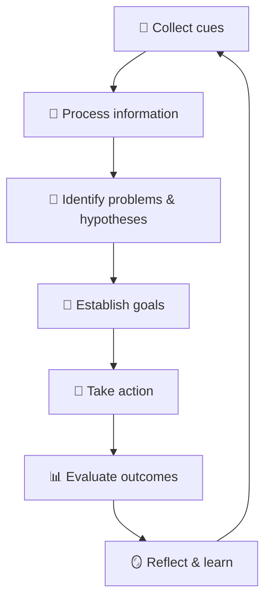

# 🧠 NURS5602 — Clinical Reasoning in Practice

Welcome to the **thinking-like-a-nurse** dojo! 🥋 This course is all about turning scattered patient clues 🕵️ into sound clinical judgments ⚖️ — fast, safe, and defensible.

!!! abstract "📖 What this course is about"
    Clinical reasoning is the engine under every nursing decision: noticing cues 👀, forming hypotheses 💭, acting on them 💉, and reflecting on outcomes 🔄. Expect case studies, simulations, and lots of "but *why* did you do that?" questions. 😅

!!! warning "⚠️ Common trap"
    Jumping to the first plausible diagnosis and anchoring there ⚓. Always ask: *"What else could this be?"* 🤔

## 🔁 The Clinical Reasoning Cycle

## 📋 Topics to Come

- 🩺 Assessment frameworks & cue recognition
- 🧩 Pattern recognition vs. analytic reasoning
- ⚖️ Diagnostic errors & cognitive biases
- 🤝 Collaborative reasoning with the MDT
- 📝 Documenting your reasoning trail

!!! tip "💡 Study hack"
    Talk your reasoning **out loud** 🗣️ while practicing cases — if you can't say it, you don't know it yet!
