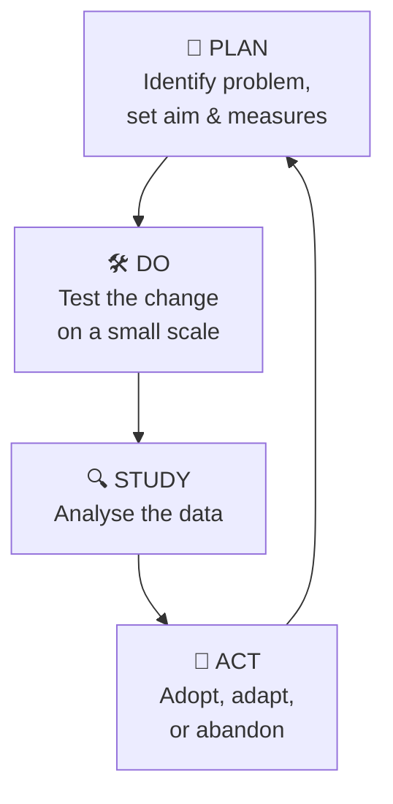

# 👑 NURS5603 — Leadership, Management and Informatics

Where nursing meets the boardroom 💼 and the server room 🖥️. This course builds the skills to lead teams, manage change, and harness health informatics — because Year 5 means you're about to *be* the junior leader on the ward. 🚀

!!! abstract "📖 What this course is about"
    Leadership styles 🎭, quality improvement 📈, conflict & delegation 🤝, Hong Kong healthcare system 🏥, nursing informatics 💾, and data-driven decision making 📊.

!!! example "🗳️ Which leader are you?"
    Transformational ✨? Transactional 🤝? Servant 🕊️? Situational 🎛️? Knowing the labels helps you flex your style on purpose.

## 🔄 Quality Improvement Cycle

## 📋 Topics to Come

- 🎭 Leadership theories & styles
- 🤝 Delegation, supervision & conflict resolution
- 📈 Quality improvement tools (PDSA, audits)
- 🏥 HK healthcare system & HA structure
- 💾 Nursing informatics & EHR systems
- 📊 Data literacy & dashboards
- 🛡️ Patient safety & incident reporting

!!! tip "💡 Career gold"
    Everything here is **interview material** 🎤 for your first RN job. Collect examples as you go!
