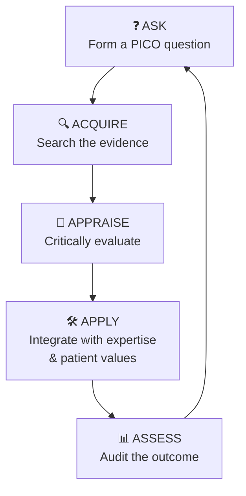

# 🔬 NURS5607 — Evidence-based Practice

The course that turns "because we've always done it this way" 🙄 into "because the evidence says so" 📚✅. EBP is where research literacy becomes bedside power. 💪

!!! abstract "📖 What this course is about"
    Asking answerable questions (PICO 🎯), searching the literature 🔍, appraising studies critically 🧐, and integrating evidence with clinical expertise and patient values ❤️ — then actually changing practice. 🔄

!!! question "🎯 PICO refresher"
    **P**opulation 👥 · **I**ntervention 💉 · **C**omparison ⚖️ · **O**utcome 📊 — the skeleton key for every EBP question.

## 🔁 The EBP Cycle

## 📋 Topics to Come

- 🎯 PICO & question formulation
- 🔍 Database searching (PubMed, CINAHL, Cochrane)
- 🧐 Critical appraisal: RCTs, SRs, qualitative studies
- 📈 Levels of evidence hierarchies
- 🧮 Basic stats for nurses (p-values, CI, NNT)
- 🔄 Implementation & knowledge translation
- 📝 Writing the EBP assignment

!!! warning "⚠️ Stats anxiety is normal"
    You don't need to *derive* anything — you need to *interpret* numbers well enough to keep patients safe. 🛡️ Start small, practise often. 🧮
